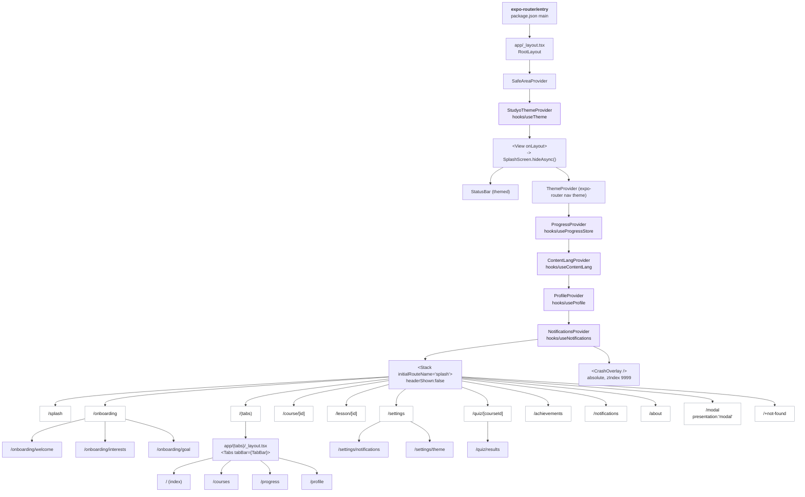
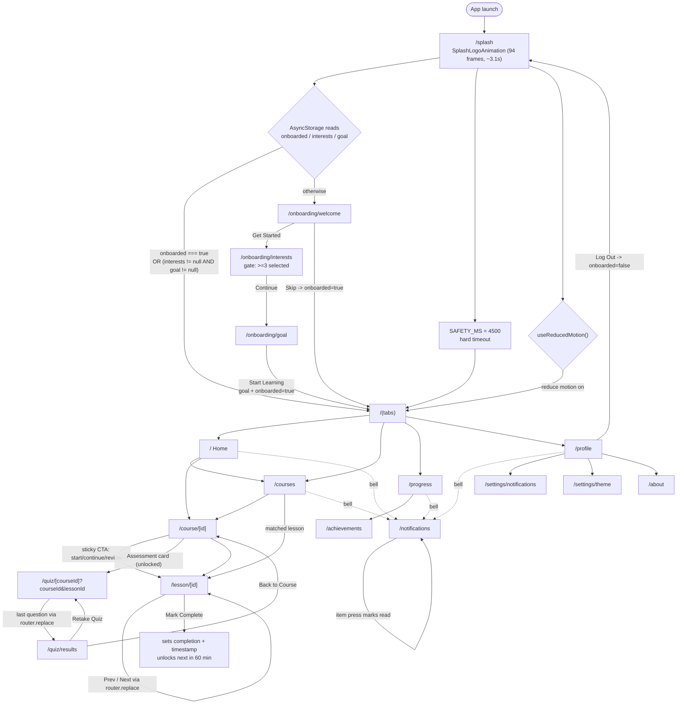
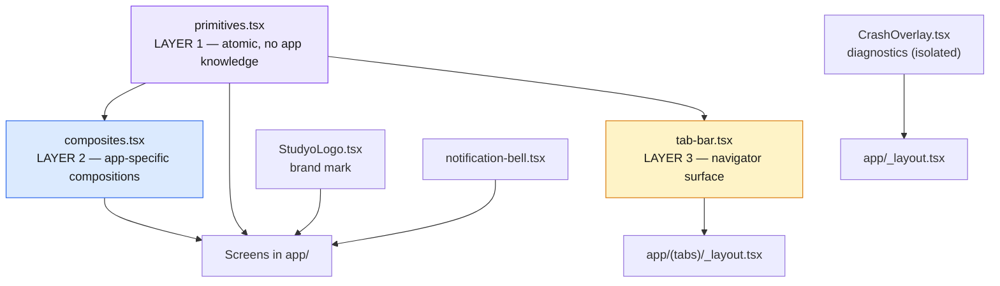
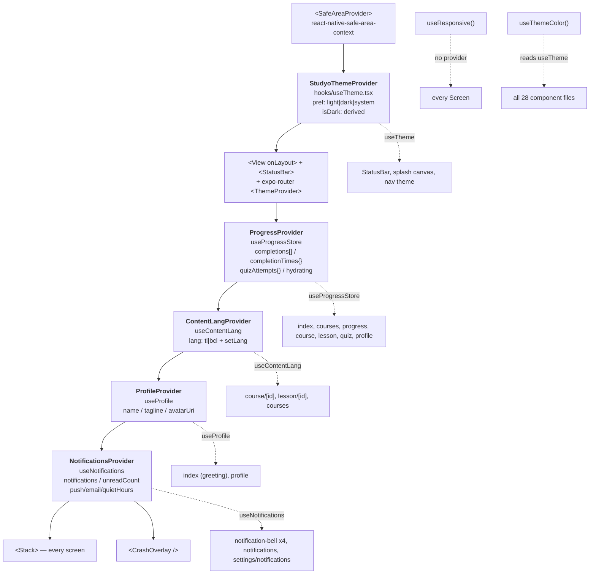
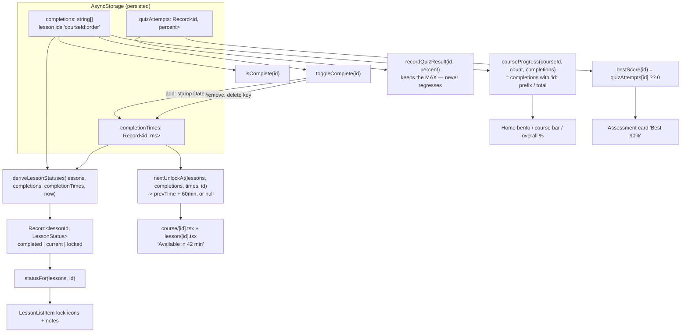
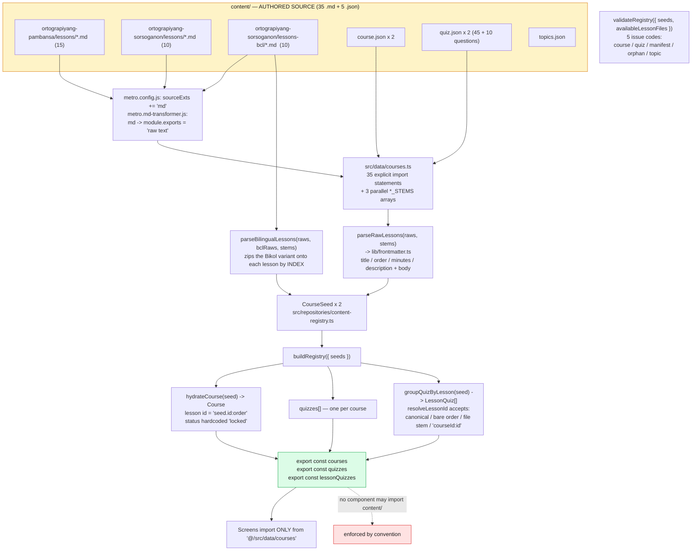
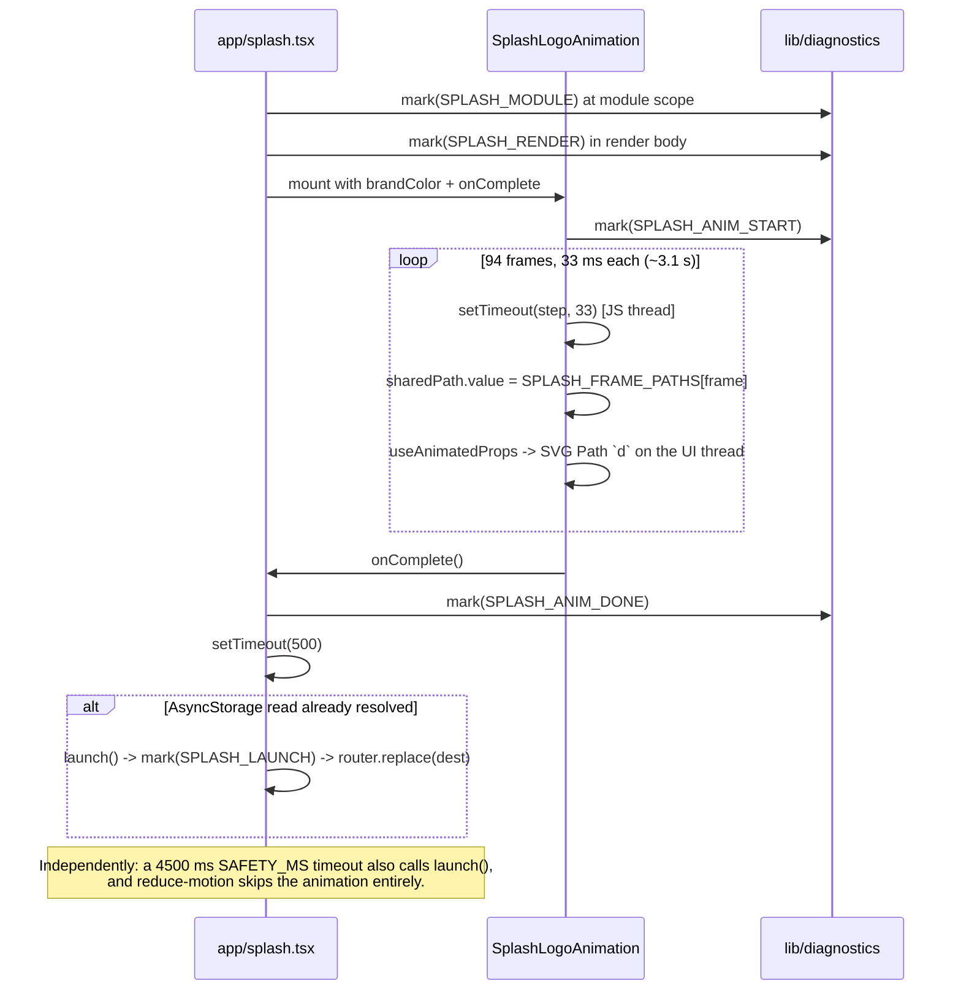

# Studyo — Complete Project Reference

> A complete, verified map of the `studyo-app` repository: configuration, routing, every page
> and subpage, the component library, the icon set, the styling system, assets, diagrams,
> wireframes, data pipeline, persistence, and current build health.

| | |
|---|---|
| **App name** | Studyo |
| **Package** | `studyo-app` (private, version 1.0.0) |
| **Android applicationId** | `com.studyo.app` |
| **URL scheme** | `studyoapp://` |
| **Branch** | `main` (single commit: `3c41324 Initial commit`) |
| **Framework** | Expo SDK 57 · React Native 0.86 · React 19.2 · Expo Router 57 |
| **Verified on** | 2026-09-29 — `tsc --noEmit` PASS · `jest` 6/9 suites · `expo lint` 4 errors |

Every factual claim here was read out of the source tree, not inferred. Where the code
contradicts its own documentation, that is called out in
[§21 Current state & findings](#21-current-state--findings).

---

## Table of contents

| # | Section |
|---|---|
| [1](#1-what-this-project-is) | What this project is |
| [2](#2-technology-stack) | Technology stack |
| [3](#3-directory-map) | Directory map |
| [4](#4-configuration) | Configuration files |
| [5](#5-routing--navigation) | Routing & navigation |
| [6](#6-screens--wireframes) | Screens & wireframes |
| [7](#7-design-system) | Design system |
| [8](#8-component-library) | Component library |
| [9](#9-icon-inventory) | Icon inventory |
| [10](#10-styling-system) | Styling system |
| [11](#11-state--persistence) | State & persistence |
| [12](#12-data--content-pipeline) | Data & content pipeline |
| [13](#13-assets--animations) | Assets & animations |
| [14](#14-type-system) | Type system |
| [15](#15-lib-utilities) | `lib/` utilities |
| [16](#16-testing) | Testing |
| [17](#17-build--deploy) | Build & deploy |
| [18](#18-development-workflow) | Development workflow |
| [19](#19-conventions) | Conventions |
| [20](#20-current-state--findings) | Current state & findings |
| [A](#appendix-a--complete-file-index) | Appendix A — file index |
| [B](#appendix-b--glossary) | Appendix B — glossary |

---

## 1. What this project is

**Studyo** is an offline-first Expo/React Native learning app for Filipino language
learners, built around two real reference works:

1. **Ortograpiyang Pambansa** — the KWF (Komisyon sa Wikang Filipino, 2013) standard for
   Filipino orthography. 15 lessons.
2. **Ortograpiyang Sorsoganon** — the Bicol University / KWF (2024) standard for Sorsoganon
   (Bikol) orthography. 10 lessons, **bilingual**: each lesson ships a Tagalog and a Bikol
   (Sorsoganon) variant, switchable in-app.

**Product characteristics:**

- **No backend.** Zero network calls. All content is bundled at build time via a custom
  Metro `.md` transformer. All state persists to `AsyncStorage` on-device.
- **Deterministic and testable.** Every derivation (lesson status, unlock timing, quiz
  grading, search, frontmatter parsing) is a pure function extracted into `lib/` or
  `hooks/` and unit-tested.
- **Time-paced sequential gating.** A lesson unlocks 60 minutes after its predecessor is
  completed, one at a time — `LESSON_UNLOCK_DELAY_MS` in `hooks/useProgressStore.tsx:20`.
- **Zero styling framework.** `StyleSheet.create` only. No NativeWind, no
  `react-native-css`, no Tailwind — despite leftover config implying otherwise
  (see [§20](#20-current-state--findings)).
- **Content-as-data.** 35 Markdown lesson files + 2 `course.json` + 2 `quiz.json` +
  `topics.json`, compiled into a validated in-memory registry at import time.

---

## 2. Technology stack

### 2.1 Runtime dependencies

| Package | Version | Role | Imported? |
|---|---|---|---|
| `expo` | `~57.0.25` | Framework | yes |
| `expo-router` | `~57.0.23` | File-based routing (entry point) | yes |
| `react` / `react-dom` | `19.2.3` | UI runtime | yes |
| `react-native` | `0.86.3` | UI runtime | yes |
| `react-native-reanimated` | `4.5.1` | Animations (tab pill, progress, toggles, splash) | yes |
| `react-native-worklets` | `0.10.1` | Reanimated 4 worklet runtime | peer only |
| `react-native-svg` | `15.15.4` | Logo, splash animation, progress rings | yes |
| `react-native-safe-area-context` | `~5.7.0` | Insets for notch / gesture bar | yes |
| `@expo/vector-icons` | `^15.0.2` | **MaterialIcons** — the only icon set | yes |
| `react-native-markdown-display` | `^7.0.2` | Renders lesson Markdown | yes |
| `@react-native-async-storage/async-storage` | `2.2.0` | All persistence | yes |
| `expo-font` | `~57.0.4` | Loads Inter + Space Mono | yes |
| `expo-splash-screen` | `~57.0.9` | Native splash control | yes |
| `expo-status-bar` | `~57.0.1` | Themed status bar | yes |
| `expo-image-picker` | `~57.0.20` | Profile avatar selection | yes |
| `expo-web-browser` | `~57.0.3` | — | **NO** — only dead `components/ExternalLink.tsx` |
| `expo-constants` | `~57.0.19` | — | **NO** — unused |
| `expo-linking` | `~57.0.11` | — | **NO** — unused (Expo Router uses its own) |
| `react-native-gesture-handler` | `~2.32.0` | — | **NO** — expo-router peer only |
| `react-native-screens` | `~4.26.0` | — | **NO** — expo-router peer only |
| `react-native-web` | `~0.21.0` | — | **NO** — web target peer only |

### 2.2 Dev dependencies

| Package | Version | Role |
|---|---|---|
| `typescript` | `~6.0.3` | Type checking |
| `eslint` | `^9.0.0` | Linter |
| `eslint-config-expo` | `~57.0.2` | Flat ESLint config |
| `jest` | `^29.0.0` | Test runner |
| `jest-expo` | `~57.0.0` | Jest preset (`"jest": { "preset": "jest-expo" }`) |
| `@testing-library/react-native` | `^14.0.1` | Hook testing |
| `@types/jest`, `@types/react` | — | Types |

### 2.3 Notable absences

There is **no** NativeWind, no `react-native-css`, no Tailwind, no `clsx`, no
`tailwind-merge`, no `yaml` package, no state-management library, and no icon library
beyond `@expo/vector-icons`. The frontmatter parser (`lib/frontmatter.ts`) and the class
combiner (`lib/cn.ts`) are hand-rolled precisely to avoid those dependencies.

---

## 3. Directory map

```
studyo-app/
│
├── app/                          <-- EXPO ROUTER — every file here is a screen
│   ├── _layout.tsx               Root Stack + all 5 providers + fonts + crash overlay
│   ├── +html.tsx                 WEB ONLY: static-render root <html> (raw CSS)
│   ├── +not-found.tsx            Catch-all 404 route
│   ├── splash.tsx                Entry route: 94-frame logo morph -> routing decision
│   ├── about.tsx                 About / feature list / version
│   ├── achievements.tsx          Full achievement gallery w/ All|Earned|Locked filters
│   ├── notifications.tsx         Notification centre (SectionList, Today/Earlier)
│   ├── modal.tsx                 Native modal presentation demo route (UNUSED)
│   ├── (tabs)/                   <-- TAB GROUP (no URL segment)
│   │   ├── _layout.tsx           <Tabs> + custom TabBar
│   │   ├── index.tsx             Home
│   │   ├── courses.tsx           Courses (search + category filter)
│   │   ├── progress.tsx          Progress (rings, quiz avg, course breakdown)
│   │   └── profile.tsx           Profile (avatar, settings, log out)
│   ├── onboarding/               <-- 3-step first-run flow
│   │   ├── _layout.tsx           Passthrough <Stack>
│   │   ├── welcome.tsx           1/3 — hero logo + Skip
│   │   ├── interests.tsx         2/3 — >=3 topic chips required
│   │   └── goal.tsx              3/3 — casual/regular/intensive
│   ├── course/[id].tsx           Course detail: Overview | Curriculum tabs + sticky CTA
│   ├── lesson/[id].tsx           Stepped lesson reader + sticky Prev/Complete/Next
│   ├── quiz/[courseId].tsx       Quiz runner (?courseId&lessonId) — non-scrolling
│   ├── quiz/results.tsx          Score ring, stats, answer review, retake
│   └── settings/
│       ├── _layout.tsx           Passthrough <Stack>
│       ├── theme.tsx             Light/Dark/System + live preview card
│       └── notifications.tsx     Push/Email/Quiet-hours toggles (custom AnimatedToggle)
│
├── src/                          <-- APPLICATION CODE (non-route)
│   ├── components/
│   │   ├── primitives.tsx        * LAYER 1 — 11 components + useThemeColor (476 LOC)
│   │   ├── composites.tsx        * LAYER 2 — 12 components (584 LOC)
│   │   ├── tab-bar.tsx           * LAYER 3 — custom animated bottom bar (144 LOC)
│   │   ├── StudyoLogo.tsx        Brand mark as inline SVG (viewBox 473x528)
│   │   ├── notification-bell.tsx Header bell w/ unread count badge
│   │   └── CrashOverlay.tsx      TEMPORARY launch-diagnostics overlay (267 LOC)
│   ├── data/
│   │   ├── courses.ts            * Content entry point — imports all 35 .md files
│   │   ├── achievements.ts       6 achievement definitions + computeAchievements()
│   │   ├── categories.ts         Onboarding topics derived from lessons
│   │   └── notifications.ts      3 seeded notifications
│   └── repositories/
│       ├── content-registry.ts   Hydrate + validate + group quizzes (224 LOC)
│       └── content-registry.test.ts
│
├── components/                   ** DEAD — untouched Expo starter template, 0 imports **
│   ├── EditScreenInfo.tsx  ExternalLink.tsx  StyledText.tsx  Themed.tsx
│   └── useClientOnlyValue.ts(.web.ts)  useColorScheme.ts(.web.ts)
│
├── constants/
│   ├── Colors.ts                 * Design tokens — light + dark, single source of truth
│   ├── Typography.ts             Font roles + type scale (NEVER IMPORTED)
│   └── storage-keys.ts           * All 13 AsyncStorage keys
│
├── hooks/
│   ├── useTheme.tsx              Theme pref (light|dark|system) + isDark
│   ├── useProgressStore.tsx      * Lesson status, unlock timing, completions, quiz scores
│   ├── useContentLang.tsx        tl|bcl bilingual toggle + text resolvers
│   ├── useProfile.tsx            name / tagline / avatarUri + initials() + firstName()
│   ├── useNotifications.tsx      Notification list + read state + channel prefs
│   ├── useResponsive.ts          * Breakpoints, padding, gap, contentMaxWidth, cols()
│   ├── useStorage.ts             Thin typed AsyncStorage wrapper
│   └── useTheme.test.tsx, useProgressStore.test.tsx
│
├── lib/                          * PURE LOGIC — no React, no storage, no I/O
│   ├── frontmatter.ts            YAML-head subset parser for lesson .md
│   ├── lesson-sections.ts        Split markdown at "## " into reader sections
│   ├── search.ts                 AND-matched course/lesson search incl. Bikol variants
│   ├── quiz-scoring.ts           gradeQuiz / recordBestScore / averageScore
│   ├── onboarding.ts             canContinueInterests / GOAL_MINUTES / goalToMinutes
│   ├── diagnostics.ts            * TEMPORARY launch breadcrumb flight recorder
│   ├── crash-capture.ts          * TEMPORARY ErrorUtils hook + crash persistence
│   ├── cn.ts                     Trivial class joiner (UNUSED)
│   └── *.test.ts (5 files)       Unit tests
│
├── types/                        Type-only modules
│   ├── course.ts  quiz.ts  user.ts  achievement.ts  notification.ts  css.d.ts
│
├── content/                      * SOURCE CONTENT (authored, not code)
│   ├── README.md  topics.json    2 topic entries; ids must match course.json ids
│   ├── ortograpiyang-pambansa/
│   │   ├── course.json  quiz.json (45 questions)
│   │   └── lessons/01..15-*.md   (15 files)
│   └── ortograpiyang-sorsoganon/
│       ├── course.json  quiz.json (10 questions)
│       ├── lessons/01..10-*.md          (10 files, Tagalog)
│       └── lessons-bcl/01..10-*.md      (10 files, Bikol / Sorsoganon)
│
├── assets/
│   ├── fonts/                    Inter-Regular, Inter-SemiBold, SpaceMono-Regular, SpaceMono-Bold
│   ├── images/                   icon, splash-icon, favicon, 3x android adaptive, studyo-logo
│   └── onboarding/
│       ├── frame-paths.ts        * 387 KB — 94 SVG path strings (compiled data)
│       ├── frames/*.svg          94 source SVGs, 399 KB — EXCLUDED from EAS builds
│       ├── svgs/*.svg            3 distilled keyframes (legacy, unused)
│       ├── components/           SplashLogoAnimation.tsx (used) / OnboardingAnimation.tsx (dead)
│       ├── hooks/                useOnboardingAnimation.ts (dead)
│       ├── generate-frame-paths.js  Build script: svgs -> frame-paths.ts
│       └── README.md  INTEGRATION_GUIDE.md
│
├── scripts/generate-icons.js     * Renders the logo SVG -> all 6 PNG app icons
│
├── screenshot-ui-studyo-mobile/  27 reference screenshots — EXCLUDED from EAS builds
│
├── app.json  package.json  eas.json  tsconfig.json
├── metro.config.js               Adds 'md' to sourceExts + custom babel transformer
├── metro.md-transformer.js       .md -> module.exports = "<raw text>"
├── eslint.config.js              eslint-config-expo flat
│
├── AGENTS.md / CLAUDE.md         Agent instructions (CLAUDE.md is just "@AGENTS.md")
├── .easignore  .gitignore
└── .claude/settings.json  .vscode/{extensions,settings}.json
```

---

## 4. Configuration

### 4.1 `app.json` — Expo app config

```jsonc
{
  "name": "Studyo",  "slug": "studyo-app",  "version": "1.0.0",
  "orientation": "portrait",
  "icon": "./assets/images/icon.png",
  "scheme": "studyoapp",
  "userInterfaceStyle": "automatic",              // enables light + dark
  "ios":      { "supportsTablet": true },
  "android":  {
    "package": "com.studyo.app", "versionCode": 1,
    "permissions": [],                            // <-- zero permissions requested
    "adaptiveIcon": {
      "backgroundColor": "#7C3AED",
      "foregroundImage": "./assets/images/android-icon-foreground.png",
      "backgroundImage": "./assets/images/android-icon-background.png",
      "monochromeImage": "./assets/images/android-icon-monochrome.png"
    },
    "predictiveBackGestureEnabled": false
  },
  "web": { "bundler": "metro", "output": "static", "favicon": "./assets/images/favicon.png" },
  "plugins": [
    "expo-router",
    ["expo-splash-screen", { "image": "./assets/images/splash-icon.png",
                             "resizeMode": "contain", "backgroundColor": "#ffffff" }]
  ],
  "experiments": { "typedRoutes": true }          // route strings are type-checked
}
```

**Notes**

- `"permissions": []` is worth flagging: `expo-image-picker` requests media-library
  permission at runtime (`app/(tabs)/profile.tsx:48`) and the app handles denial with an
  `Alert` — but an empty permission list can push the request to install time or block it
  on some Android versions. Verify before shipping.
- No `ios.bundleIdentifier` is set. EAS will assign one on first build; production iOS
  builds will fail until it exists.
- `experiments.typedRoutes` is why `router.push('/course/[id]')`-style paths are validated
  by `tsc` — and it currently passes.

### 4.2 `package.json` — entry point & scripts

```jsonc
{
  "main": "expo-router/entry",     // <-- Expo Router, NOT "expo/AppEntry" or "index.js"
  "private": true,
  "jest": { "preset": "jest-expo" }
}
```

| Script | Command |
|---|---|
| `npm start` | `expo start` |
| `npm run ios` / `android` / `web` | `expo start --ios` / `--android` / `--web` |
| `npm run lint` | `expo lint` |
| `npm test` | `jest` |

> `AGENTS.md` says to use `bunx` when `bun.lock` is present. There is **no** `bun.lock` —
> the project uses `package-lock.json`, so `npx` is correct here.

### 4.3 `tsconfig.json`

```jsonc
{
  "extends": "expo/tsconfig.base",
  "compilerOptions": {
    "strict": true,
    "types": ["jest"],
    "paths": { "@/*": ["./*"] }      // <-- why every import starts with "@/"
  },
  "include": ["**/*.ts", "**/*.tsx", ".expo/types/**/*.ts", "expo-env.d.ts"]
}
```

`@/*` maps to the repo root. So `@/constants/Colors`, `@/src/components/primitives`, and
`@/content/ortograpiyang-pambansa/lessons/01-introduksiyon.md` all resolve.
**`npx tsc --noEmit` currently passes with zero errors.**

### 4.4 `metro.config.js` + `metro.md-transformer.js` — the content pipeline

This two-file pair is the mechanism that lets Markdown lessons be `import`ed as strings.

```js
// metro.config.js
config.resolver.sourceExts.push('md');                             // teach Metro about .md
config.transformer.babelTransformerPath = require.resolve('./metro.md-transformer.js');
```

```js
// metro.md-transformer.js
if (/\.mdx?$/.test(filename)) {
  const jsSrc = `module.exports = ${JSON.stringify(src)};`;      // raw text -> JS string
  return upstreamTransformer.transform({ filename: filename + '.js', src: jsSrc, options, plugins });
}
return upstreamTransformer.transform({ filename, src, options, plugins });  // everything else
```

The `*.md` module declaration lives in `types/css.d.ts:10`. **Consequence:** adding a new
lesson `.md` file requires a matching `import` in `src/data/courses.ts` plus an entry in
the parallel `*_STEMS` array — a missing import means the file silently never ships.

### 4.5 `eas.json` — EAS Build profiles

| Profile | Type | Distribution | Android | Notes |
|---|---|---|---|---|
| `development` | dev client | `internal` | `apk`, `:app:assembleDebug` | |
| `preview` | release | `internal` | `apk` | For the release-crash hunt in `lib/crash-capture.ts` |
| `production` | release | store | `app-bundle` | `autoIncrement: true` |

`"appVersionSource": "local"` — `version` / `versionCode` in `app.json` are authoritative;
EAS will not read them from a store listing. `submit.production` is empty (uses defaults).

### 4.6 `eslint.config.js`

Flat config, `eslint-config-expo/flat`, ignoring `dist/*`. No custom rules. Current
result: **4 errors, 14 warnings** (full list in [§20](#20-current-state--findings)).

### 4.7 `.easignore` — what never ships

Deliberately excluded from the build bundle:

```
screenshot-ui-studyo-mobile/        27 dev screenshots
.claude/  .vscode/  .github/         tooling
AGENTS.md  CLAUDE.md  LICENSE  *.md docs
**/*.test.ts(x)  **/*.spec.ts(x)    tests
assets/onboarding/frames/           94 source SVGs (399 KB) — compiled to frame-paths.ts
assets/onboarding/svgs/             3 legacy keyframes
assets/onboarding/generate-frame-paths.js
assets/onboarding/{README,INTEGRATION_GUIDE}.md
assets/onboarding/components/OnboardingAnimation.tsx   <-- documented as dead
assets/onboarding/hooks/useOnboardingAnimation.ts      <-- documented as dead
.git/  .DS_Store  Thumbs.db
```

> Note: `*.md` is listed for exclusion, but `content/**/*.md` **is** still bundled — the
> app ships its lessons. The pattern semantics differ between `.gitignore` and
> `.easignore`; this works today but the exclusion is fragile.

### 4.8 `.gitignore` highlights

`node_modules/`, `.expo/`, `dist/`, `web-build/`, `expo-env.d.ts`, native keystores
(`*.jks *.p8 *.p12 *.key *.mobileprovision`), `.metro-health-check*`, `*.tsbuildinfo`,
and — importantly — **`/ios` and `/android`**: this is a CNG (Continuous Native
Generation) project. The native folders are generated and must never be hand-edited.

---

## 5. Routing & navigation

### 5.1 Navigator hierarchy



### 5.2 Root stack declaration — `app/_layout.tsx:131-145`

```tsx
<Stack initialRouteName="splash" screenOptions={{ headerShown: false }}>
  <Stack.Screen name="splash" options={{ animation: 'none' }} />
  <Stack.Screen name="onboarding" />
  <Stack.Screen name="(tabs)" />
  <Stack.Screen name="course" />
  <Stack.Screen name="lesson" />
  <Stack.Screen name="quiz" />
  <Stack.Screen name="settings" />
  <Stack.Screen name="achievements" />
  <Stack.Screen name="notifications" />
  <Stack.Screen name="about" />
  <Stack.Screen name="modal" options={{ presentation: 'modal' }} />
  <Stack.Screen name="+not-found" />
</Stack>
```

`unstable_settings = { initialRouteName: 'splash' }` (line 29) backs this at the router
level. There is deliberately **no `app/index.tsx`** — the root stack begins at `splash`.

### 5.3 Complete route table

| Route (URL) | File | Type | Title / purpose |
|---|---|---|---|
| `/splash` | `app/splash.tsx` | Stack (entry) | Animated logo; decides next destination |
| `/onboarding` | `app/onboarding/_layout.tsx` | Stack group | Passthrough `<Stack screenOptions={{headerShown:false}} />` |
| `/onboarding/welcome` | `app/onboarding/welcome.tsx` | Push | Step 1/3 — hero logo, Skip |
| `/onboarding/interests` | `app/onboarding/interests.tsx` | Push | Step 2/3 — >=3 topic chips |
| `/onboarding/goal` | `app/onboarding/goal.tsx` | Push -> `/(tabs)` | Step 3/3 — daily pace |
| `/(tabs)` | `app/(tabs)/_layout.tsx` | Tabs | 4-tab shell, custom bar |
| `/` (index) | `app/(tabs)/index.tsx` | Tab 1 | Home — greeting, bento stats, continue, recommended |
| `/courses` | `app/(tabs)/courses.tsx` | Tab 2 | Search + category filter + grid/list |
| `/progress` | `app/(tabs)/progress.tsx` | Tab 3 | Overall ring, quiz avg, course breakdown, badges |
| `/profile` | `app/(tabs)/profile.tsx` | Tab 4 | Avatar, inline edit, settings group, log out |
| `/course/[id]` | `app/course/[id].tsx` | Push | Course detail — Overview/Curriculum + sticky CTA |
| `/lesson/[id]` | `app/lesson/[id].tsx` | Push (replace) | Stepped reader + sticky Prev/Complete/Next |
| `/quiz/[courseId]` | `app/quiz/[courseId].tsx` | Push (replace) | Quiz runner. Params: `courseId`, `lessonId` |
| `/quiz/results` | `app/quiz/results.tsx` | — | Score ring, stats, review, retake |
| `/settings` | `app/settings/_layout.tsx` | Stack group | Passthrough `<Stack />` |
| `/settings/theme` | `app/settings/theme.tsx` | Push | Light/Dark/System + preview |
| `/settings/notifications` | `app/settings/notifications.tsx` | Push | 3 animated toggles |
| `/achievements` | `app/achievements.tsx` | Push | Full gallery + filters |
| `/notifications` | `app/notifications.tsx` | Push | Sectioned list + filters + mark-all-read |
| `/about` | `app/about.tsx` | Push | Feature list, version, footer |
| `/modal` | `app/modal.tsx` | **Modal** | Demo modal route (template residue, unreferenced) |
| `*` (404) | `app/+not-found.tsx` | Catch-all | "Page not found" + Go Home |
| *(web only)* | `app/+html.tsx` | — | Static root HTML shell |

### 5.4 Navigation flow



### 5.5 Routing subtleties worth knowing

1. **Splash self-redirect on web.** `app/_layout.tsx:93-112` uses a *module-level*
   `let _webSplashPending = true` so `/splash` always plays on a fresh browser page load
   regardless of which URL was reloaded — while surviving Fast Refresh.
2. **Native splash hides on layout, not on route.** `handleRootLayout` calls
   `SplashScreen.hideAsync()` from a `View onLayout`, guarded by a `useRef` so it fires once.
3. **Lesson navigation uses `replace`, not `push`.** `/lesson/[id] -> /lesson/[id]`
   (`app/lesson/[id].tsx:138,156`). Prev/Next does *not* grow the history stack, so the
   hardware back button exits the course rather than walking back through lessons.
4. **Quiz hardware-back is intercepted** (`app/quiz/[courseId].tsx:39-42`) with a
   `BackHandler` listener plus `Alert` to stop accidental loss.
5. **`/quiz/[courseId]` requires `lessonId` too** but the segment name only carries
   `courseId`. `lessonId` arrives as a query param, e.g.
   `/quiz/ortograpiyang-pambansa?lessonId=ortograpiyang-pambansa:3`.
6. **`modal.tsx` and the `modal` Stack.Screen are unreferenced** — template residue.

---

## 6. Screens & wireframes

All wireframes below are ASCII renderings of the actual JSX structure, not design mock-ups.

### 6.1 `/splash`

```
┌──────────────────────────────────────┐
│                                      │
│                                      │
│          ~~~~~~~~~~~~~~              │
│        ~~~ S T U D Y O ~~~          │
│          ~~~~~~~~~~~~~~              │
│                                      │
│      (94 SVG frames @ 33ms)          │
│                                      │
│                                      │
│                                      │
│                                      │
└──────────────────────────────────────┘
bg  = light #f9f9f9 / dark Colors.dark.background
mark = accent (theme-reactive)
```

- Full-bleed `View` + `SplashLogoAnimation` (`app/splash.tsx:76-82`).
- Three signals race to `launch()` (guarded by `launched.current`): the animation's
  `onComplete` (+500 ms), the AsyncStorage read resolving with `reduceMotion === false`,
  and a 4500 ms safety timeout.
- Calls `mark()` from `@/lib/diagnostics` at module scope, on render, and on launch.

### 6.2 Onboarding

```
/onboarding/welcome  —  PageIndicator 1 of 3      /onboarding/interests  —  2 of 3
┌──────────────────────────────┐                   ┌──────────────────────────────┐
│                          Skip│                   │ ←                            │
│        [ StudyoLogo ]        │                   │ What do you want to learn?   │
│         192–240px           │                   │ Select at least 3 topics…    │
│                              │                   │ ┌─────────┐┌─────────┐        │
│     Learn without limits     │                   │ │▣menu-book││▢menu-book│ (grid, 48%)
│  Track your progress, build  │                   │ └─────────┘└─────────┘        │
│  streaks, and master new…    │                   │ ┌─────────┐┌─────────┐        │
│                              │                   │ │▢ …     ││▢ …     │        │
│      ● ─  ○  ○                │                   │ └─────────┘└─────────┘        │
│    [    Get Started    ]      │                   │  4 of 25 selected            │
└──────────────────────────────┘                   │      ●  ─  ○                 │
                                                    │  [ Continue ] (disabled <3)  │
/onboarding/goal  —  3 of 3                         └──────────────────────────────┘
┌──────────────────────────────┐
│ Set your daily goal           │
│ How much time… each day?      │
│ ◉  Casual                     │
│    15 min/day — relaxed pace  │
│ ○  Regular                    │
│    30 min/day — strong habit  │
│ ○  Intensive                  │
│    60 min/day — immerse fully │
│                                │
│        ○  ─  ●                │
│   [   Start Learning   ]      │
└──────────────────────────────┘
```

**Layout system.** All three screens use `useResponsive()` + `useSafeAreaInsets()` instead
of `SafeAreaView`:
`topPad = insets.top + 8`, `bottomPad = Math.max(insets.bottom, 16) + 16`,
`maxWidth = contentMaxWidth` (720 on tablet), `alignSelf: 'center'`.
The goal screen skips the header entirely and uses `paddingTop: insets.top + 24`.

`logoSize = Math.min(isTablet ? 240 : 192, width * 0.48)` — so the hero logo shrinks on
narrow phones rather than clipping.

### 6.3 Tab 1 — `/` Home

```
┌──────────────────────────────┐
│ ⊙ Studyo                 🔔 2 │
│                              │
│ Hello, Ana!                  │
│ Ready to continue your       │
│ journey?                     │
│                              │
│ ┌────────────┐┌────────────┐ │
│ │🔥 Daily Streak││ Daily Goal │ │
│ │             ││0/30 min  │ │
│ │    0 Days   ││Regular pace│ │
│ │             ││▓▓▓░░░░░░░░│ │
│ └────────────┘└────────────┘ │
│                              │
│ Continue Learning  View All  │
│ ┌──────────────────────────┐ │
│ │ WIKA                      │ │
│ │ ▣  Ortograpiyang Pambansa │ │
│ │     Komisyon sa Wikang…  │ │
│ │ 40% complete · 2h 30m    │ │
│ │ ▓▓▓▓░░░░░░░░░░░░░░░░░░░░ │ │
│ └──────────────────────────┘ │
│                              │
│ Recommended for You          │
│ ┌──────┐┌──────┐  horizontal  │
│ │▣     ││▣     │  carousel, or │
│ │Title ││Title │  2-col grid   │
│ │ 0%   ││ 0%   │  on tablet /  │
│ └──────┘└──────┘  landscape    │
│                              │
├──────────────────────────────┤
│   🏠    🎓    📊    👤        │
└──────────────────────────────┘
```

**Composition**

| Slot | Component |
|---|---|
| Header | `Screen showLogo` -> `<StudyoLogo size={28}/>` + "Studyo" wordmark + `<NotificationBell/>` |
| Greeting | `Text` SpaceMono_700Bold at `headingSize` |
| Bento | 2x `Card` (flex:1): fire icon + streak value; goal + `ProgressBar` |
| Continue | `Skeleton` x5 (while `hydrating`) -> `EmptyState` -> `CourseCard variant="list"` |
| Recommended | `FlatList horizontal` of `CourseCard variant="compact"` (240 px) **or** 2-col wrap of `variant="list"` when `isTablet \|\| isLandscape` |

**Layout switching** — `recommendedCols = (isTablet || isLandscape) ? cols(260) : 1`;
`recommendedHorizontal = recommendedCols === 1`. `cols(min)` comes from `useResponsive`.

**Placeholder data** — `const studiedMinutes = 0;` is hardcoded (line 37). The Daily Goal
card and the Daily Streak both read 0; `computeStreak` exists but is never fed real
day-keys. Streaks are a designed-but-unwired feature.

### 6.4 Tab 2 — `/courses`

```
┌──────────────────────────────┐
│ ⊙ Studyo                 🔔 2 │
│ ┌──────────────────────────┐ │
│ │🔍  Search courses...     ✕ │ │
│ └──────────────────────────┘ │
│ (All) (Wika) (Language)      │
│                              │
│ ┌──────────────────────────┐ │
│ │ WIKA                      │ │
│ │ ▣  Ortograpiyang Pambansa │ │
│ │     Komisyon sa Wikang…  │ │
│ │ 40% complete · 2h 30m    │ │
│ │ ▓▓▓▓░░░░░░░░░░░░░░░░░░░░ │ │
│ │ MATCHING LESSONS         │ │
│ │  ✓ 01 Introduksiyon  8min│ │
│ │  🔒 02 Alpabeto  🔒 Locked │ │
│ │ +3 more in this course    │ │
│ └──────────────────────────┘ │
│                              │
├──────────────────────────────┤
│   🏠    🎓    📊    👤        │
└──────────────────────────────┘
```

- **Search** — `TextInput` in a bordered row (44 px min). Web-only `outlineStyle:'none'`
  via `Platform.select`. Clear button appears when `search.length > 0`.
- **Categories** — derived from `courses` into `['All', ...unique]`. `active` is
  initialised from `useLocalSearchParams<{category?:string}>()`.
- **Search matching** — `searchCourses(scoped, search)` AND-matches every whitespace term
  against `title + category + instructor + all lesson bodies (incl. Bikol variants)`.
  Matching lessons are listed beneath their parent course, capped at
  `MAX_LESSON_CARDS = 4`, then a `+N more in this course` line. Locked lessons are
  non-pressable and annotated `Locked — open the course to unlock`.
- **Grid mode** — `(isTablet || isLandscape) && !searching` -> 2-col `flexWrap` with
  `minWidth: 280`. Searching always falls back to a single column so nested
  "matching lessons" stay readable.
- **Three empty/loading states** — `hydrating` -> 3 hand-rolled skeleton cards;
  `courses.length === 0` -> `EmptyState icon="menu-book"`;
  `results.length === 0` -> `EmptyState icon="search"`.

### 6.5 Tab 3 — `/progress`

```
┌──────────────────────────────┐
│ ⊙ Studyo                 🔔 2 │
│ Your Progress                 │
│ Keep up the momentum.         │
│                              │
│ ┌───────────┐┌──────────────┐│
│ │    ◯ 87%  ││🔥            ││
│ │    ring   ││     0        ││
│ │  Overall  ││  Day Streak  ││
│ │           ││──────────────││
│ │           ││ 🧠    —      ││
│ │           ││  Quiz Avg   ││
│ │           ││──────────────││
│ │           ││ ✅    12     ││
│ │           ││ Lessons Done││
│ └───────────┘└──────────────┘│
│                              │
│ Quiz Performance             │
│ ┌──────────────────────────┐ │
│ │ ◯ 82%   82%              │ │
│ │        Average across 4   │ │
│ │        quizzes taken      │ │
│ └──────────────────────────┘ │
│                              │
│ Course Breakdown             │
│ Ortograpiyang Pambansa   40% │
│ ▓▓▓▓░░░░░░░░░░░░░░░░░░░░░░░ │
│ Ortograpiyang Sorsoganon  0% │
│ ░░░░░░░░░░░░░░░░░░░░░░░░░░░░░ │
│                              │
│ Achievements  2 of 6  See All│
│ ┌────┐┌────┐┌────┐ horizontal │
│ │🏆  ││🔒  ││🏅  │             │
│ └────┘└────┘└────┘             │
├──────────────────────────────┤
│   🏠    🎓    📊    👤        │
└──────────────────────────────┘
```

- **Overall ring** — `ProgressRing progress={overallPct} size={isTablet?120:100} strokeWidth={9}`.
  `overallPct = round(completeCount / totalLessonsAcrossAllCourses * 100)`.
- **Mini cards** — Day Streak (`primaryFixed` bg, fire icon), Quiz Avg, Lessons Done
  (bordered). Stack `column` on phone, `row` on tablet/landscape.
- **Quiz performance** — `averageScore(Object.values(quizAttempts))`; `—` when none taken.
- **Course breakdown** — one `ProgressBar` per course with `animate={false}` (avoids 15
  simultaneous 600 ms tweens).
- **Achievements** — `computeAchievements(completions, quizAttempts, courses)`; horizontal
  `FlatList` of `AchievementBadge variant={earned ? 'primary' : 'locked'}`, width
  `isTablet ? 160 : 128`.

### 6.6 Tab 4 — `/profile`

```
┌──────────────────────────────┐
│ ⊙ Studyo                 🔔 2 │
│ ┌──────────────────────────┐ │
│ │         ( AN ) 📷         │ │
│ │      <- camera button     │ │
│ │        Studyo Student     │ │
│ │        ✎ Edit profile     │ │
│ │   2 COURSES │ 87% AVG     │ │
│ └──────────────────────────┘ │
│                              │
│ Settings                     │
│ ┌──────────────────────────┐ │
│ │ 👤  Account            🔒 │ │
│ │ ────────────────────────  │ │
│ │ 🔔  Notifications      ›  │ │
│ │ ────────────────────────  │ │
│ │ 🌙  Theme        System › │ │
│ │ ────────────────────────  │ │
│ │ ℹ   About Studyo      ›  │ │
│ └──────────────────────────┘ │
│                              │
│ ┌──────────────────────────┐ │
│ │      ⇥   Log Out         │ │
│ └──────────────────────────┘ │
├──────────────────────────────┤
│   🏠    🎓    📊    👤        │
└──────────────────────────────┘
```

**Two states of the hero card** (`editing` boolean):

| State | Contents |
|---|---|
| View | Avatar circle (96/120 px) + camera button, name, tagline, "Edit profile" |
| Edit | Auto-focused `Display name` (max 40) + `Tagline` (max 60) inputs, optional "Remove photo", `Cancel` / `Save` buttons |

- **Avatar** — `accent` circle. If `avatarUri` -> `<Image>`; else initials from
  `initials(name)` at `avatarSize * 0.375`.
- **Photo picking** — `ImagePicker.requestMediaLibraryPermissionsAsync()` -> if denied,
  `Alert.alert('Permission needed', …)`. Then `launchImageLibraryAsync({ mediaTypes:
  ['images'], allowsEditing: true, aspect: [1,1], quality: 0.5, base64: true })`. The
  base64 payload becomes a `data:image/jpeg;base64,…` URI stored in AsyncStorage — **a real
  problem for large images** (see [§20](#20-current-state--findings)).
- **Settings group** — one `Card` with `overflow:'hidden'` and 16 px-inset 1 px dividers,
  producing an iOS-style grouped list from 4 `SettingsRow`s.
- **Log Out** — sets `studyo.onboarded = false` and `router.replace('/splash')`. It does
  **not** clear completions, quiz scores, or profile — re-onboarding preserves progress.

### 6.7 `/course/[id]`

```
┌──────────────────────────────────────┐
│ ‹                                    │
│ ┌────┐  Ortograpiyang Sorsoganon      │
│ │ ▣  │  Komisyon sa Wikang Filipino   │
│ │64px│                                 │
│ └────┘                                 │
│ 🌐 [ Tagalog | Bikol ]  <- bilingual  │
│                                      │
│ [ Completed ] [ Wika ]                 │
│ 40% complete · 1h 45m                 │
│ ▓▓▓▓░░░░░░░░░░░░░░░░░░░░░░░░░░░░░░░ │
│                                      │
│   Overview  ┃  Curriculum             │
│ ┄┄┄┄┄┄┄┄ active tab = 2px accent line │
│                                      │
│ <OVERVIEW TAB>                        │
│ Ang opisyal na gabay sa wastong…      │
│ ┌──────────────────────────────┐      │
│ │ What you'll learn             │     │
│ │ ✓ Apply the 28-letter…       │     │
│ │ ✓ Distinguish tuldik marks   │     │
│ │ ✓ Follow KWF punctuation     │     │
│ └──────────────────────────────┘      │
│ ASSESSMENT                           │
│ One quiz per lesson — unlocks after…  │
│ ┌──────────────────────────────┐      │
│ │ 🧠 1. Introduksiyon      ›   │     │
│ │    3 questions · Best 90%    │     │
│ ├──────────────────────────────┤      │
│ │ 🔒 2. Grafema                 │     │
│ │    Complete the lesson…      │     │
│ └──────────────────────────────┘      │
│                                      │
│ <CURRICULUM TAB>                      │
│ Curriculum   4 of 10 complete         │
│ ✓ 01 Introduksiyon            8 min  │
│ ▶ 02 Grafema                  12 min │
│ 🔒 03 Silaba  Available in 42 min    │
├──────────────────────────────────────┤
│        [   Continue   ]              │
└──────────────────────────────────────┘
```

**Everything on this screen is derived from `useProgressStore`:**

| Value | Source | Purpose |
|---|---|---|
| `statuses[]` | `statusFor(course.lessons, id)` per lesson | `completed` / `current` / `locked` |
| `currentEntry` | first entry with status `current` | the resume target |
| `allDone` | every entry `completed` | switches CTA to "Review course" |
| `timeLocked` | no `current` and not `allDone` | CTA disabled + countdown |
| `gatedAt` | `unlockAtFor(lessons, id)` | `Available in 42 min` |
| `ctaLabel` | composed | `Start` / `Continue` / `Review course` / `Available in N min` / `Available soon` |
| `unlocked` (per quiz) | `isComplete(lq.lessonId)` | assessment card pressable |

- **Live countdown** — `setInterval(() => setNow(Date.now()), 30000)` re-renders the
  "Available in X min" label every 30 s. (`minsLabel` = `max(1, ceil(ms/60000))`, so a
  90-second wait still reads "1 min".)
- **Bilingual toggle** — rendered only when `course.bicol` exists. Two pill buttons
  (`Tagalog` / `Bikol`) that call `setLang('tl' | 'bcl')`; every title, description and
  body then resolves through `courseText()` / `lessonText()`.
- **Two local tabs** — `activeTab: 'overview' | 'curriculum'`, plain `useState`, with a
  2 px accent underline. Distinct from the bottom tab bar.
- **Hardcoded outcomes** — the three "What you'll learn" bullets are literal strings in the
  JSX (lines 150-153), not derived from course content. Both courses currently show the
  same Filipino-alphabet bullets.

### 6.8 `/lesson/[id]`

```
┌──────────────────────────────────────┐
│ ‹   Ang Alpabetong Filipino: 28…      │
│ ▓▓▓▓▓▓▓▓▓▓░░░░░░░░░░░░░░░░░░░░░░░░░ │
│ 🕐 12 min · Section 2 of 5 · ✓ Read  │
│                                      │
│ ┏━━━━━━━━━━━━━━━━━━━━━━━━━━━━━━━━┓   │
│ ┃▌ ## Ano ang Titik?               ┃   │
│ ┃▌ Ang titik o letra ay isang…    ┃   │
│ ┃▌ (active = accent border +       ┃   │
│ ┃▌  surface background)            ┃   │
│ ┗━━━━━━━━━━━━━━━━━━━━━━━━━━━━━━━━┛   │
│                                      │
│ ┌ ─ ─ ─ ─ ─ ─ ─ ─ ─ ─ ─ ─ ─ ─ ─ ┐   │
│ ┊ previous sections at 45%        ┊   │
│ ┊ opacity, transparent background ┊   │
│ ┌ ─ ─ ─ ─ ─ ─ ─ ─ ─ ─ ─ ─ ─ ─ ─ ┐   │
│ ┊ (future sections NOT rendered) ┊   │
│                                      │
│ ┌──────────────────────────────┐     │
│ │        Continue        ⌄     │     │
│ └──────────────────────────────┘     │
│ ┌──────────────────────────────┐     │
│ │ 🕐 You've finished this lesson.│     │
│ │    The next one unlocks in 42…│    │
│ └──────────────────────────────┘     │
│                                      │
├──────────────────────────────────────┤
│ [Prev]  [  Mark Complete  ]  [Next]  │
└──────────────────────────────────────┘
```

**The stepped-reader mechanic** — the defining interaction of the app:

1. `splitLessonSections(content)` (`lib/lesson-sections.ts`) splits the markdown at every
   level-2 heading (`## `). Text before the first `## ` (the `# Title` + intro) is
   section 1. `###` headings stay inside their parent. Headings inside ``` fences are
   ignored.
2. `revealed` starts at `1`; `sections.slice(0, revealed)` renders only what has been read.
3. Styles: active section = `accent` border + `surface` background;
   already-read sections = `border` + `transparent` at `opacity: 0.45`;
   unrevealed sections are simply not in the tree.
4. Pressing **Continue** does `setRevealed(r => min(total, r + 1))` and re-derives the
   header progress bar (`revealed / total`).
5. `read = revealed >= total`. Only then does the centre button become
   `Mark Complete`; before that it shows the hint *"Tap Continue to read each section."*
6. **State reset on param change** — `trackedId !== params.id` resets `revealed` to `1`
   (or to `total` if already complete). This is a **render-phase setState**
   (`app/lesson/[id].tsx:48-53`), a React anti-pattern; it works but is a candidate for
   `useEffect` or a `key` on the route.
7. Meta row copy switches: `Lesson 3 of 15` once fully revealed, `Section 2 of 5` while
   reading.
8. **Sticky nav** — `Prev` (secondary, `minWidth:72`, disabled at index 0),
   centre (primary/secondary `Mark Complete` or `Completed`), `Next` (ghost, disabled
   when the next lesson is `locked`).

### 6.9 `/quiz/[courseId]`

```
┌──────────────────────────────────────┐
│ ‹   Question 3 of 5                    │
│ ▓▓▓▓▓▓▓▓▓▓▓▓░░░░░░░░░░░░░░░░░░░░░░░░░ │
│ (8px segments, 6px gap, rounded)      │
│ ┌──────────────────────────────────┐   │
│ │ Ilang titik ang bumubuo sa      │   │
│ │ alpabetong Sorsoganon?          │   │
│ └──────────────────────────────────┘   │
│ ┌──────────────────────────────────┐   │
│ │ (A)  26                          │   │
│ ├──────────────────────────────────┤   │
│ │ (B)  27                          │   │
│ ├──────────────────────────────────┤   │
│ │ (C)  28                       ✓   │   │
│ │ (green border + 20% green wash) │   │
│ ├──────────────────────────────────┤   │
│ │ (D)  30                          │   │
│ └──────────────────────────────────┘   │
│ ┌──────────────────────────────────┐   │
│ │ Explanation                      │   │
│ │ Ang alpabetong Sorsoganon ay…    │   │
│ │ (variant='filled' -> bg token)  │   │
│ └──────────────────────────────────┘   │
│                                      │
├──────────────────────────────────────┤
│   [ Submit Answer ] then either:      │
│   [ Next Question ] / [ See Results ] │
└──────────────────────────────────────┘
```

- `scroll={false}` on `Screen` — the quiz is a fixed-height, non-scrolling surface.
- **Two-phase per question**: select -> *Submit Answer* -> `showResult` freezes all options
  (`disabled`), reveals correct/wrong colouring and the explanation -> *Next Question*.
- **Option states** in `QuizOption` (`src/components/composites.tsx:402-415`):

  | State | Border | Background | Letter chip | Trailing icon |
  |---|---|---|---|---|
  | idle | `border` | transparent | `border` bg, muted text | — |
  | selected | `accent` | `accent` @ 20% | `accent` bg, white text | — |
  | correct (after submit) | `success` | `success` @ 20% | `success` bg | `check-circle` |
  | wrong (after submit) | `danger` | `danger` @ 20% | `danger` bg | `cancel` |

  Note the correct answer is revealed **whether or not** the learner picked it, which is
  the pedagogically correct choice for a teaching app.
- **Exit guard** — `Alert.alert('Leave quiz?', 'Your progress will be lost.')` with
  Stay / Leave, wired to both the back button and the Android hardware back.
- **Timing** — `startTimeRef` set on mount; `timeMs = Date.now() - start` sent to results.
- **On finish** — score computed inline with a `reduce` over `finalAnswers`,
  `recordQuizResult(quiz.lessonId, percent)`, then
  `router.replace('/quiz/results', …)` passing `score`, `total`, `timeMs`, and
  `answers: JSON.stringify(finalAnswers)` as **route params**.

### 6.10 `/quiz/results`

```
┌──────────────────────────────────────┐
│ ‹   Quiz Results                      │
│                                      │
│            ◯  80%                    │
│          Great job!                  │
│    You scored 80% on this quiz.      │
│                                      │
│ ┌──────────────┐┌──────────────────┐  │
│ │✅  4/5        ││🕐  1m 24s       │  │
│ │  Correct     ││  Time           │  │
│ └──────────────┘└──────────────────┘  │
│                                      │
│ Answer Review                        │
│ ┌──────────────────────────────────┐  │
│ │ 1. Ilang titik ang bumubuo sa…? │  │
│ │ ✅ Your answer: 28               │  │
│ │ Ang alpabetong Sorsoganon ay…   │  │
│ └──────────────────────────────────┘  │
│ ┌──────────────────────────────────┐  │
│ │ 2. Ano ang tuldik?               │  │
│ │ ❌ Your answer: 8                │  │
│ │ (border stays 'border')         │  │
│ └──────────────────────────────────┘  │
│                                      │
│       [   Retake Quiz   ]            │
│       [   Back to Course  ]          │
└──────────────────────────────────────┘
```

- `gradeLabel(percent)`: `100 -> "Excellent!"`, `>=80 "Great job!"`, `>=70 "Good work!"`,
  `>=50 "Keep going!"`, else `"Try again!"`.
- `minsLabel(ms)`: `<60s -> "42s"`, else `"1m 24s"`.
- Review cards re-derive `chosen` from the `answers` JSON param and re-read the quiz from
  `lessonQuizzes` by `lessonId`. A wrong answer shows `cancel` icon but the card border is
  `border` (not `danger`) — deliberate, avoids three red boxes.
- `answers` is parsed inside a `try/catch` defaulting to `[]` (defensive: route params are
  untrusted input).

### 6.11 `/settings/theme`

```
┌──────────────────────────────────────┐
│ ‹   Theme                              │
│ ┌──────────────────────────────┐      │
│ │ ☀  Light         Always use   ◉  │  │
│ │    light mode                 │    │
│ ├──────────────────────────────┤      │
│ │ 🌙  Dark         Always use   ○  │  │
│ │    dark mode                  │    │
│ ├──────────────────────────────┤      │
│ │ 🔆  System       Follow sys.  ○  │  │
│ └──────────────────────────────┘      │
│                                      │
│ Preview                             │
│ Changes apply immediately.          │
│ ┌──────────────────────────────┐      │
│ │ WIKA                          │    │
│ │ ▣  Ortograpiyang Pambansa     │    │
│ │    Komisyon sa Wikang Filipino │   │
│ │ 40% complete · 2h 30m         │    │
│ │ ▓▓▓▓░░░░░░░░░░░░░░░░░░░░░░░░ │    │
│ └──────────────────────────────┘      │
└──────────────────────────────────────┘
```

- Three `Pressable` cards, `accessibilityRole="radio"` + `accessibilityState.checked`.
- Active: `border`->`accent`, bg `accent` @ `0D` (5%), icon chip `accent` @ `1A` (10%),
  radio ring + dot filled.
- **The Preview card is a deliberate, self-contained mock** — it does *not* read real
  course data; the values `WIKA`, `Ortograpiyang Pambansa`, `40% complete · 2h 30m` are
  hardcoded so the theme switch is instantly legible.
- `setPref` writes synchronously to state and fire-and-forget to AsyncStorage, so the
  switch is instant and a write failure cannot block it.

### 6.12 `/settings/notifications`

```
┌──────────────────────────────────────┐
│ ‹   Notifications                      │
│ Channels                             │
│ ┌──────────────────────────────┐      │
│ │ 🔔  Push Notifications    ◗━━ │      │
│ │ ──────────────────────────── │      │
│ │ ✉   Email Digest         ◗━━ │      │
│ └──────────────────────────────┘      │
│                                      │
│ Schedule                             │
│ ┌──────────────────────────────┐      │
│ │ 🌙  Quiet Hours (10pm–7am)  ◗━━ │     │
│ └──────────────────────────────┘      │
└──────────────────────────────────────┘
```

- `AnimatedToggle` (local to this file) — `interpolateColor` on the track from
  `border`->`accent`, `translateX` 2->22 on the thumb, `withTiming(…, 200)`.
  `accessibilityRole="switch"`.
- This **duplicates the `Toggle` primitive** in `primitives.tsx:383-408` (44x28, 150 ms,
  `onAccent` thumb). The local one is 46x26 with a shadow. Two toggles, two behaviours —
  worth consolidating.

### 6.13 `/achievements`

```
┌──────────────────────────────────────┐
│ ‹   Achievements                        │
│ 2 of 6 earned                   33%   │
│ ▓▓▓▓▓▓▓░░░░░░░░░░░░░░░░░░░░░░░░░░░░ │
│ ( All ) ( Earned ) ( Locked )         │
│                                      │
│ ┌──────────┐┌──────────┐             │
│ │    🏆    ││    🔒    │             │
│ │  (0.6)   ││  (0.6)   │             │
│ │  First   ││  Getting │             │
│ │  Step    ││  Started │             │
│ │ Earned   ││  Locked  │             │
│ └──────────┘└──────────┘             │
│ ┌──────────┐┌──────────┐             │
│ │    🏅    ││    🎓    │             │
│ │  Quiz    ││  Course  │             │
│ │  Ace     ││ Champion │             │
│ └──────────┘└──────────┘             │
└──────────────────────────────────────┘
```

- Header progress: `earnedCount / achievements.length` with a `ProgressBar`.
- Three pill filters; `numColumns={2}` `FlatList` with `scrollEnabled={false}`
  (the outer `Screen` `ScrollView` does the scrolling).
- Locked badges render at `opacity: 0.6` with a `lock` icon on a `border` background.

### 6.14 `/notifications`

```
┌──────────────────────────────────────┐
│ ‹   Notifications                      │
│ (All)(Unread)(Course)(System)  Mark all│
│                                      │
│ Today                                │
│ ┌──────────────────────────────────┐  │
│ │ ℹ  Welcome to Studyo!         ●  │  │
│ │    Start your first lesson…      │  │
│ │    Today                         │  │
│ ├──────────────────────────────────┤  │
│ │ 🎓 New course available      ●  │  │
│ │    Bikol–Sorsogon Orthography…   │  │
│ │    1d ago                        │  │
│ └──────────────────────────────────┘  │
│ Earlier                              │
│ ┌──────────────────────────────────┐  │
│ │ 🏆 Achievement unlocked          │  │
│ │    Complete your first lesson…   │  │
│ │    2d ago                        │  │
│ └──────────────────────────────────┘  │
└──────────────────────────────────────┘
```

- `SectionList` with sections built by `groupByTime()` — anything whose `time` is
  `"Today"` (case-insensitive) goes to **Today**, everything else to **Earlier**.
  Empty sections are omitted entirely.
- `stickySectionHeadersEnabled={false}`; `ItemSeparatorComponent` is a 1 px inset rule.
- Filters: `Unread` -> `!read`; `Course` -> `type==='course'`; `System` -> `type==='system'`.
  (`achievement` items are only reachable via `All`.)
- Tapping an unread item calls `markRead(id)`; the "Mark all read" link only appears when
  `unreadCount > 0`.
- Icon colour by type: `course -> accent`, `achievement -> star`, `system -> textMuted`.

### 6.15 `/about`

```
┌──────────────────────────────────────┐
│ ‹   About                              │
│           ┌────────┐                 │
│           │  logo  │  88x88 r24      │
│           └────────┘                 │
│            Studyo                    │
│          Version 1.0.0               │
│                                      │
│ ┌──────────────────────────────────┐  │
│ │ ▣  Filipino Orthography          │  │
│ │    Based on the Ortograpiyang…    │  │
│ ├──────────────────────────────────┤  │
│ │ ⊘  Offline-First                  │  │
│ │    All lessons load from device…  │  │
│ ├──────────────────────────────────┤  │
│ │ 📊  Progress Tracking             │  │
│ ├──────────────────────────────────┤  │
│ │ 🌙  Dark Mode                     │  │
│ └──────────────────────────────────┘  │
│                                      │
│   Made with ♥ for Filipino…         │
│   © 2025 Studyo                      │
└──────────────────────────────────────┘
```

`FEATURES` is an `as const` array of 4 `{icon, title, desc}` objects defined at the top of
the file. `APP_VERSION = '1.0.0'` is **hardcoded**, duplicating `package.json` /
`app.json`. It will silently go stale.

### 6.16 `+not-found` and `/modal`

```
/+not-found                        /modal  (presentation:'modal')
┌──────────────────────┐          ┌──────────────────────┐
│ ‹  Not Found         │          │ ‹  Modal             │
│        🔍 (44px)      │          │   [   Close   ]     │
│     Page not found    │          └──────────────────────┘
│  This route doesn't…  │
│   [  Go Home  ]       │
└──────────────────────┘
```

`/modal` is unreferenced Expo template residue.

---

## 7. Design system

### 7.1 Colour tokens — `constants/Colors.ts`

Typed as `ThemeColors`. **No component may hardcode a hex**; everything reads via
`useThemeColor('token')` (`primitives.tsx:36-39`).

| Token | Light | Dark | Used for |
|---|---|---|---|
| `background` | `#FAFAFA` | `#0E0E12` | Screen canvas, tab bar, card `variant="filled"` |
| `surface` | `#FFFFFF` | `#1A1A20` | Cards, inputs, sticky CTAs, secondary buttons |
| `accent` | **`#7C3AED`** | **`#A78BFA`** | Brand violet — CTAs, active state, links, focus |
| `text` | `#1A1A1A` | `#F5F5F5` | Primary text |
| `textMuted` | `#6B7280` | `#9CA3AF` | Secondary text, meta, disabled |
| `border` | `#E5E7EB` | `#2A2A33` | Outlines, dividers, progress tracks |
| `tabDefault` | `#9CA3AF` | `#6B7280` | Inactive tab icon + label |
| `tabSelected` | `#7C3AED` | `#A78BFA` | (defined; the tab bar reads `accent` instead) |
| `success` | `#16A34A` | `#22C55E` | Correct answers, completion, `Badge variant="success"` |
| `star` | `#F59E0B` | `#F59E0B` | Streaks, achievements, `Badge variant="warning"` |
| `danger` | `#DC2626` | `#EF4444` | Log out, wrong answers, `Badge variant="error"`, unread badge |
| `onAccent` | `#FFFFFF` | **`#1E1B4B`** | Text on accent — dark navy, because the dark accent is *light* lavender |
| `primaryFixed` | `#eaddff` | `#2d2455` | M3 primary-fixed pill behind the active tab icon |
| `tint` | `#7C3AED` | `#A78BFA` | Navigation alias |
| `tabIconDefault` | `#9CA3AF` | `#6B7280` | Navigation alias |
| `tabIconSelected` | `#7C3AED` | `#A78BFA` | Navigation alias |

**Colour-derivation convention** — instead of alpha functions, the codebase appends a hex
alpha pair to a 6-digit hex, via the local helper `withAlpha(hex, '33')`
(`composites.tsx:14`) or inline template literals:

| Suffix | Alpha | Applied to |
|---|---|---|
| `'0D'` | 5% | Selected theme option background |
| `'15'` | 8% | `SettingsRow` icon chip |
| `'1A'` | 10% | `about.tsx` / `theme.tsx` feature + option icon chips |
| `'20'` | 12% | `StatCard`, `AchievementBadge`, `NotificationItem` icon chips |
| `'26'` | 15% | Course icon tiles, quiz icon tile, `StatCard` |
| `'33'` | 20% | Selected `CategoryChips`, active goal option, `CourseCard` tile |
| `'4d'` | 30% | Log-out button border (`${danger}4d`) |
| `'00'` | 0% | Tab pill "off" state |

**Navigation theme** — `app/_layout.tsx:35-59` builds `StudyoLightNavTheme` /
`StudyoDarkNavTheme` by spreading `DefaultTheme`/`DarkTheme` and overriding
`primary / background / card / text / border` from the same token file, then feeds
`expo-router`'s `ThemeProvider`. This is what makes headers and tint follow the app theme.

### 7.2 Typography

**Fonts** — 4 vendored TTFs, ~856 KB total, loaded via `useFonts` in `app/_layout.tsx:62-68`:

| Expo Font key | File | Role |
|---|---|---|
| `Inter_400Regular` | `Inter-Regular.ttf` (334 KB) | Body |
| `Inter_600SemiBold` | `Inter-SemiBold.ttf` (336 KB) | Medium / labels / buttons |
| `SpaceMono_400Regular` | `SpaceMono-Regular.ttf` (91 KB) | Code, markdown mono |
| `SpaceMono_700Bold` | `SpaceMono-Bold.ttf` (95 KB) | **All headings and numeric display** |
| `SpaceMono` | `SpaceMono-Regular.ttf` | Alias |

`constants/Typography.ts` declares the roles:

```ts
fonts = { display:'SpaceMono_700Bold', title:'SpaceMono_700Bold',
          body:'Inter_400Regular', medium:'Inter_600SemiBold', semibold:'Inter_600SemiBold' }
```

…plus a `typography` scale:

| Role | Family | Size / line-height | Extra |
|---|---|---|---|
| `display` | SpaceMono 700 | 28 / 34 | |
| `title` | SpaceMono 700 | 22 / 28 | |
| `subtitle` | Inter 600 | 18 / 24 | |
| `body` | Inter 400 | 16 / 24 | |
| `caption` | Inter 400 | 14 / 20 | |
| `overline` | Inter 600 | 12 / 16 | `letterSpacing: 0.6`, uppercase |

> `Typography.ts` is **exported but never imported by any screen** — every screen inlines
> `fontFamily: 'Inter_400Regular'` / `'SpaceMono_700Bold'` in a local `StyleSheet.create`.
> The scale exists as documentation, not as an enforced contract.

**The de-facto type scale actually used in screens:**

| Element | Family | Size | File |
|---|---|---|---|
| Page greeting / title | SpaceMono 700 | 20–28 (responsive `headingSize`) | index, progress |
| Section header | SpaceMono 700 | 20 | `composites.tsx:536` |
| Card / course title | SpaceMono 700 | 16 | `composites.tsx:547` |
| Course page title | SpaceMono 700 | 20 | `course/[id].tsx:245` |
| Screen header title | Inter 600 | 18 (20 tablet) | `primitives.tsx:462` |
| Button label | Inter 600 | 16 | `primitives.tsx:465` |
| Body | Inter 400 | 13–16 | everywhere |
| Overline / stat label | Inter 400/600 | 12 | `letterSpacing: 1`, uppercase |
| Wordmark | SpaceMono 700 | 20 | `primitives.tsx:458`, `letterSpacing: -0.5` |

Space Mono ships only 400 and 700, so **every heading is 700** — there is no medium weight
in the display face. That is the core of the visual identity: a monospaced "terminal"
heading voice over a neutral grotesque body.

### 7.3 Spacing, radii, elevation

**Breakpoints** — `hooks/useResponsive.ts`:

| Breakpoint | Width | `hPad` | `gap` | `cardPad` | `contentMaxWidth` | `headingSize` | `bodySize` |
|---|---|---|---|---|---|---|---|
| `xs` | < 375 | **14** | 16 | 16 | width | **20** | **13** |
| `sm` | 375–429 | 20 | 16 | 16 | width | 24 | 14 |
| `md` | 430–767 | **24** | 16 | 16 | width | 24 | 14 |
| `lg` | >= 768 | **32** | **20** | **20** | **min(width, 720)** | **28** | **15** |

Plus flags `isTablet` (>=768), `isLargePhone` (>=430), `isSmall` (<375), `isLandscape`
(width > height) — and `cols(minItemWidth)`, which is how the app decides between a
horizontal carousel and a 2-column grid.

**Radii** — a small consistent set:

| Radius | Where |
|---|---|
| `999` (pill) | chips, badges, toggle track+thumb, page dots, avatars, circular icon tiles |
| `16` | cards, buttons, inputs, section cards, sticky CTAs, lesson section cards |
| `12` | search clear button, `quizOption`, text inputs, `iconWrap` (44/44) |
| `8` | skeleton base, progress fill fallback |

**Elevation** — effectively none. There is **no shadow on any card**. Depth is expressed
purely via `borderWidth: 1` plus the `border` token, with exactly one exception:
`toggleThumb` in `app/settings/notifications.tsx` — the only shadow in the app
(`shadowOpacity 0.15, shadowRadius 4, elevation 2`).

**Card variants** (`primitives.tsx:183-208`) — the complete depth language:

| Variant | Background | Border |
|---|---|---|
| `outlined` (default) | `surface` | 1 px `border` |
| `filled` | `background` (i.e. the *canvas*, so it reads as a recessed well) | 1 px `border` |
| `elevated` | `surface` | 1 px `border` — **declared in the type, identical to `outlined`; never used** |

### 7.4 Motion

| Where | Technique | Spec |
|---|---|---|
| `ProgressBar` | `useSharedValue` + `useAnimatedStyle` on `width` | `withTiming(600ms)`, or instant when `animate={false}` |
| `ProgressRing` | `react-native-svg` `<Circle>` | `strokeDashoffset` — **not animated**; re-renders on data change |
| `TabBar` pill | `interpolateColor` + `interpolate(scale)` | `withTiming(150ms)`, scale 0.85->1, `primaryFixed` @ 00->FF |
| `TabBar` label | `interpolateColor` | `tabDefault`->`accent`, 150 ms |
| `SettingsRow` / `Button` / `Card` press | `usePressed()` — plain `useState` | `scale: 0.95`, `opacity: 0.9` (no timing function) |
| `Toggle` (primitive) | `translateX` | `withTiming(150ms)`, 0->22 |
| `AnimatedToggle` (settings) | `interpolateColor` + `translateX` | `withTiming(200ms)`, 2->22, 46x26 |
| `Skeleton` | `withRepeat(withTiming(0.4), -1, true)` | 900 ms, infinite, reverse |
| `SplashLogoAnimation` | `setTimeout` on the **JS thread** + `useAnimatedProps` on `d` | 94 frames @ 33 ms ~= 3.1 s |
| `useReducedMotion()` | Splash bypasses straight to `launch()` | Respected |

`usePressed` is a JS-thread `useState` inside a primitive, so every `Button`/`Card` press
triggers a React re-render. It works and is simple, but it is the one place where a
worklet would be strictly better.

---

## 8. Component library

Three explicit layers, declared in the file headers as **"Layer-1 / Layer-2 / Layer-3"**.



### 8.1 Layer 1 — `src/components/primitives.tsx` (476 LOC)

| Export | Kind | Props | Behaviour |
|---|---|---|---|
| `useThemeColor` | hook | `(colorName: keyof ThemeColors) => string` | `isDark ? Colors.dark[n] : Colors.light[n]` |
| `Icon` | component | `name, size=20, color, style` | Wraps `MaterialIcons`; `color` defaults to theme `text` |
| `Screen` | component | `title, onBack, right, showLogo, scroll=true, progress, contentContainerStyle` | **The app shell.** See breakdown below |
| `Card` | component | `variant='outlined'\|'filled'\|'elevated', onPress, style` | `View` when no `onPress`, `Pressable` with `usePressed` when there is |
| `Button` | component | `variant='primary'\|'secondary'\|'ghost'\|'danger', size='sm'\|'md'\|'lg', label\|children, loading, disabled, onPress` | `ActivityIndicator` when loading; `opacity 0.5` when inactive; min-heights 44/44/48 |
| `ProgressBar` | component | `value, animate=true, style` | 8 px track, `borderRadius 999`, 600 ms tween |
| `ProgressRing` | component | `progress, size=72, strokeWidth=8` | Two `<Circle>`s, `rotate(-90)`, `strokeLinecap="round"` |
| `Badge` | component | `variant='default'\|'success'\|'warning'\|'error', label` | Pill; `default` gets a border, the rest are solid fills |
| `Avatar` | component | `size='sm'\|'md'\|'lg', name` | **Dead** — never imported |
| `Skeleton` | component | `style` | Pulsing `border`-coloured block, 900 ms infinite |
| `Toggle` | component | `value, onValueChange, disabled` | 44x28 track, 24 thumb, 150 ms — used only by `SettingsRow` |
| `PageIndicator` | component | `total, current` | Active dot is a 24x8 pill; inactive 8x8 |
| `Themed` | object | — | **Dead** — `View`/`Text`/`Pressable` shims, never imported |

**`Screen` anatomy** — the single most important primitive:

```
<View style={{flex:1, backgroundColor}}>          <- outermost, owns the canvas
└── <SafeAreaView edges={['top','left','right']}>  <- 'bottom' deliberately EXCLUDED
    ├── [4px progress track + accent fill]        <- only when `progress` prop is set
    ├── HEADER (showLogo ? wordmark : title/onBack/right)
    │     showLogo :  <StudyoLogo size=28/> + "Studyo"   |  right slot
    │     title     :  < back (hitSlop 8) + title (1 line) |  right slot
    │     neither   :  no header at all
    └── BODY
          scroll=true  -> <ScrollView showsVerticalScrollIndicator={false}>
          scroll=false -> <View>
          both use contentContainerStyle:
            padding: hPad,
            paddingBottom: hPad + 16 + insets.bottom,
            gap,
            alignSelf: 'center',
            maxWidth: contentMaxWidth
```

Two deliberate choices in `Screen`:

- `edges={['top','left','right']}` omits `bottom` so a sticky CTA can sit flush against
  the gesture bar; the bottom inset is instead folded into
  `contentContainerStyle.paddingBottom` so scrolled content never hides behind it.
- `progress` renders a 4 px bar **above** the header, used only by `/lesson/[id]`.

### 8.2 Layer 2 — `src/components/composites.tsx` (584 LOC)

| Export | Purpose | Notable detail |
|---|---|---|
| `CategoryChips` | Filter/topic chips | `grid` prop -> `width: '48%'`; `accessibilityState.selected` |
| `CategoryChipItem` (type) | `{ id, label, icon?, selected }` | Also imported by `app/onboarding/interests.tsx` |
| `SectionHeader` | Title + optional subtitle + optional action | 20 px SpaceMono title, 14 px muted subtitle |
| `EmptyState` | 44 px icon + title + body + optional action | `paddingVertical: 48` |
| `CourseCard` | `variant='list' \| 'compact'` | `compact` = fixed 240 px carousel card; `list` = category overline + 48 px tile + meta + bar. Shows `Badge "Completed"` at >=100% |
| `LessonListItem` | Curriculum row | Status icon from `LESSON_STATUS_ICON`; `note` line for lock reasons |
| `StreakCard` | Streak + 7-day heat strip | **Dead** — never imported |
| `LessonBody` | Markdown renderer | `react-native-markdown-display` with a full theme map |
| `StatCard` | icon + value + label | Used only by quiz results |
| `AchievementBadge` | `variant='primary'\|'tertiary'\|'locked'` | Locked -> `opacity 0.6` + `lock` icon + `border` bg |
| `QuizOption` | A/B/C/D answer row | 5-state colour machine — see [§6.9](#69-quizcourseid) |
| `NotificationItem` | Notification row | Unread -> `text` colour + 8 px accent dot |
| `SettingsRow` | Grouped-list row | Four render modes: `locked`, `toggle`, `value+chevron`, plain press |

`LessonBody`'s Markdown theme (`composites.tsx:289-305`):

| Element | Style |
|---|---|
| `body` | Inter 400, 16/24, `text` |
| `heading1/2/3` | SpaceMono 700, 28/22/18, `text` |
| `paragraph` | `marginTop: 8` |
| `link` | `accent`, underlined |
| `strong` | Inter 600, `text` |
| `blockquote` | 2 px `accent` left border, 12 px padding, `textMuted`, italic |
| `codeBlock` | `surface` bg, 1 px `border`, radius 12, **SpaceMono 400** |
| `code_inline` | `surface` bg, `accent` text, SpaceMono 400 |
| `hr` | 1 px `border`, `marginVertical: 12` |
| `table` | `surface` bg + 1 px `border` |
| `list_item` | `text` |

### 8.3 Layer 3 — `src/components/tab-bar.tsx` (144 LOC)

```
TabBar  —  borderTopWidth 1, minHeight 56, background = background token
├── paddingBottom = max(insets.bottom, 8)      (gesture bar / home indicator)
├── paddingLeft/Right = insets.left / right   (notch, landscape rounded corners)
│
├── TabItem  🏠 home        "Home"
├── TabItem  🎓 school      "Courses"
├── TabItem  📊 leaderboard "Progress"
└── TabItem  👤 person      "Profile"

each TabItem:
  Pressable  minHeight 44, minWidth 44
  pillWrap   48 x 32  (pill sits behind the icon, position:absolute)
  pill       primaryFixed @00 -> FF, scale 0.85 -> 1   (withTiming 150ms)
  icon       accent when active, else tabDefault
  label      tabDefault -> accent                        (withTiming 150ms)
  accessibilityState.selected
```

`navigation.navigate` is a no-op when already on that tab (`if (!isActive)`), which
prevents tab-stack growth. Tabs are declared **twice**: `TABS` in `tab-bar.tsx` (with
icons) and in `app/(tabs)/_layout.tsx` (names + titles). They must be kept in sync
manually.

### 8.4 Brand + chrome

| Component | Detail |
|---|---|
| `StudyoLogo` | Inline `react-native-svg`, `viewBox="0 0 473 528"`, **22 `<Path>` elements** with per-path `fillOpacity` from 0.063 to 0.867 creating a stippled/halftone effect. Props: `size=192, color='#7C3AED', style`. Sourced from `stitch_minimalist_learning_design_system/studyo_logo_copy_removeg_preview.svg` |
| `NotificationBell` | `notifications-active` when `unreadCount > 0`, else `notifications-none`. Red count badge, `'9+'` cap at 9. `accessibilityLabel` announces the count |
| `CrashOverlay` | Absolute fill, `zIndex 9999`, dark `#1a1a1a`, `StatusBar barStyle="light-content"`. Renders one of 4 verdicts + the crash record + the launch trail + a Dismiss button. **Deliberately built on bare RN primitives** (no Reanimated, no custom fonts, no svg) so it still works if those subsystems are what crashed |

---

## 9. Icon inventory

**One icon set only: `@expo/vector-icons` -> `MaterialIcons`.** Typed as
`MaterialIconName = ComponentProps<typeof MaterialIcons>['name']` (`types/course.ts:5`),
so a typo is a compile error. All rendering goes through the `Icon` primitive.

**32 distinct icons** are used in application code.

### 9.1 Navigation & chrome

| Icon | Where |
|---|---|
| `arrow-back` | `onboarding/interests` back button |
| `chevron-left` | `Screen` back button (detail screens) |
| `chevron-right` | `SettingsRow` value rows, course-assessment cards |
| `close` | Courses search clear button |
| `expand-more` | Lesson "Continue" button |

### 9.2 Tab bar

| Icon | Tab |
|---|---|
| `home` | Home |
| `school` | Courses — also Achievement "Course Champion" — also a notification |
| `leaderboard` | Progress — also an About feature card |
| `person` | Profile |

### 9.3 Learning state

| Icon | Meaning | Where |
|---|---|---|
| `play-arrow` | Lesson status `current` | `LESSON_STATUS_ICON` |
| `check-circle` | Lesson status `completed`; correct answer; "Read" marker | multiple |
| `lock` | Lesson status `locked`; locked achievement; locked quiz | multiple |
| `quiz` | Quiz-nav icon; "No quizzes yet" | progress, course detail |
| `task-alt` | "Lessons Done" stat | progress |
| `schedule` | Duration meta; timed-lock notice; results "Time" | lesson, results |
| `translate` | Language-toggle label | course detail |
| `menu-book` | Course icon (both courses); empty state; About feature | multiple |

### 9.4 Achievement icons

| Icon | Achievement |
|---|---|
| `emoji-events` | **First Step**, **Perfect Score**; "No achievements yet" empty state; a notification |
| `military-tech` | **Getting Started** |
| `workspace-premium` | **Committed** |
| `star` | **Quiz Ace**; also `Badge variant="warning"` |
| `school` | **Course Champion** |

### 9.5 Settings & profile

| Icon | Where |
|---|---|
| `manage-accounts` | Settings -> Account (locked) |
| `notifications` | Settings -> Push Notifications |
| `notifications-active` | Settings row; `NotificationBell` (unread state) |
| `notifications-none` | `NotificationBell` (read state); empty state |
| `email` | Settings -> Email Digest |
| `dark-mode` | Settings -> Theme; About feature; Quiet Hours |
| `light-mode` | Theme option |
| `settings-brightness` | Theme option (System) |
| `info` | Settings -> About; a notification |
| `edit` | Profile "Edit profile" |
| `photo-camera` | Profile avatar camera button |
| `delete-outline` | Profile "Remove photo" |
| `logout` | Profile "Log Out" |

### 9.6 Status & feedback

| Icon | Meaning |
|---|---|
| `local-fire-department` | Streak (home bento, progress mini-card, `StreakCard`) |
| `search` | Courses search field; "Nothing here yet"; "not found" states |
| `search-off` | `+not-found` |
| `cancel` | Wrong answer (quiz option, results review) |
| `cloud-off` | About -> Offline-First |
| `spellcheck` | Present in the source tree |

### 9.7 Non-`MaterialIcons` brand assets

| Asset | Where used | Notes |
|---|---|---|
| `StudyoLogo` (inline SVG) | Welcome hero, About, `Screen showLogo` wordmark | 22 paths, 473x528 viewBox |
| `SplashLogoAnimation` (94 SVG paths) | `/splash` only | 387 KB path array, `viewBox 0 0 720 1280` |
| `studyo-logo.png` (80 KB) | **Not imported anywhere** | standalone raster |

> The icon set is Material (Google), but the design language is Material **3**
> (`primaryFixed`, pill-shaped active tab). There is no licensing concern, but the mix of
> M3 tokens with Google's older Material glyph set is worth a deliberate visual review.

---

## 10. Styling system

There are **no `.css`, `.scss`, or `.sass` files in this project.** Styling is
`StyleSheet.create` plus inline theme objects, with exactly one exception.

### 10.1 The one stylesheet

`app/+html.tsx` is web-only and injects raw CSS into the static-render shell:

```css
body { background-color: #fff; }
@media (prefers-color-scheme: dark) { body { background-color: #000; } }
```

Its purpose is to prevent a white flash before hydration on dark-mode web. It also
includes `<ScrollViewStyleReset />` from `expo-router/html`, which disables body scrolling
so `ScrollView` behaves like native.

### 10.2 The `StyleSheet.create` convention

Every screen and component follows an identical pattern: **a module-level, lowercase
`const s = StyleSheet.create({...})` at the bottom of the file**, referenced as
`s.someKey`. Composites use `cs.*`, the tab bar uses `tb.*`, the bell uses `nb.*`.

| Layer | Contains | Example |
|---|---|---|
| **Static style** | fonts, radii, structural flex, min-heights, `textTransform`, `letterSpacing` | `greeting: { fontFamily: 'SpaceMono_700Bold', fontSize: 24 }` |
| **Dynamic style** | theme colour + responsive value, spread at the call site | `style={[s.title, { color: text, fontSize: headingSize }]}` |

The dynamic layer is *always* an inline object literal that overrides the static layer.
This is why `StyleSheet.create` entries never contain a colour.

### 10.3 The theme-colour rule

```tsx
const accent = useThemeColor('accent');   // once per component, at the top
// ...
<View style={[s.tile, { backgroundColor: withAlpha(accent, '26') }]} />
```

Called **16 times across 16 files** — one call per token per component, never inside
`.map()` or a render loop.

### 10.4 Responsive styling

`useResponsive()` replaces media queries. Screens read `hPad`, `gap`, `headingSize`,
`bodySize`, `contentMaxWidth`, `isTablet`, `isLandscape`, `cols(n)` and branch in JSX:

```tsx
const recommendedCols = isTablet || isLandscape ? cols(260) : 1;
const recommendedHorizontal = recommendedCols === 1;
const ringSize = isTablet ? 120 : 100;
const avatarSize = isTablet ? 120 : 96;
```

Font sizes are overridden at the call site rather than in the stylesheet
(`{ color: text, fontSize: headingSize }`).

### 10.5 Platform-specific styling

Only two places use `Platform`:

| File | Technique |
|---|---|
| `app/(tabs)/courses.tsx:15` | `Platform.select({ web: { outlineWidth: 0, outlineStyle: 'none' } })` cast to `StyleProp<TextStyle>` — removes the web focus ring on the search input |
| `app/_layout.tsx:108` | `Platform.OS === 'web'` guards the splash self-redirect |

Platform-specific *files* (`.web.ts`) exist only in the dead `components/` directory.

### 10.6 Spacing scale in practice

There is no spacing token file. Values are literal:

| Value | Usage |
|---|---|
| `4` | tight icon-to-label gaps, inline `marginBottom` |
| `6` | meta-row gaps, quiz segment gap, `SectionHeader` subtitle |
| `8` | standard inter-item gap, card inner gaps, dividers |
| `10` | CTA stack gap (results screen) |
| `12` | card internal gap, list gaps, icon-to-text in settings rows |
| `14` | xs `hPad` |
| `16` | default `gap`, card padding, `progress.tsx` mini-card gap |
| `20` | default `hPad`, lg `cardPad` |
| `24` | `hPad` on large phones |
| `32` | tablet `hPad`, `hPad * 2` inside `cols()` |

---

## 11. State & persistence

### 11.1 Provider architecture



**Order matters.** `StudyoThemeProvider` must be outermost of the app providers because
`StatusBar`, the nav `ThemeProvider`, and every `useThemeColor()` call depend on it.
`ProgressProvider` sits above `ContentLangProvider` because the course/lesson screens
consume both.

### 11.2 Storage keys — `constants/storage-keys.ts`

| Key | Type | Written by | Read by |
|---|---|---|---|
| `studyo.theme` | `ThemePref` | `useTheme.setPref` | `useTheme` on mount |
| `studyo.onboarded` | `boolean` | onboarding goal/skip, **Log Out** | `app/splash.tsx` routing decision |
| `studyo.goal` | `Goal` | `onboarding/goal.tsx` | `app/(tabs)/index.tsx` |
| `studyo.interests` | `string[]` | `onboarding/interests.tsx` | `app/splash.tsx` (presence check) |
| `studyo.completions` | `string[]` | `useProgressStore.toggleComplete` | `useProgressStore` |
| `studyo.completionTimes` | `Record<string, number>` | `useProgressStore.toggleComplete` | `useProgressStore` (unlock timing) |
| `studyo.quiz.attempts` | `Record<string, number>` | `useProgressStore.recordQuizResult` | progress, profile |
| `studyo.contentLang` | `'tl'\|'bcl'` | `useContentLang.setLang` | `useContentLang` |
| `studyo.profile` | `{name, tagline, avatarUri?}` | `useProfile.setProfile` | `useProfile` |
| `studyo.notifications.read` | `string[]` | `useNotifications.markRead/markAllRead` | `useNotifications` |
| `studyo.diagnostics.lastCrash` | `CrashRecord` | `lib/crash-capture` | `CrashOverlay` |
| `studyo.diagnostics.launchTrail` | `Trail` | `lib/diagnostics` | `CrashOverlay` |
| `studyo.schemaVersion` | — | **reserved, never written** | — |

**Three keys bypass `STORAGE_KEYS`** and are hardcoded in `useNotifications.tsx:33-35,60-62`:
`studyo.notif.push`, `studyo.notif.email`, `studyo.notif.quiet`. Inconsistent with the
single-source-of-truth rule in that file.

**No versioned migration.** The comment in `storage-keys.ts:4` says so explicitly —
`schemaVersion` is reserved for a future migration.

### 11.3 Hydration model

Every provider follows the same three-step pattern to avoid a flash of wrong content:

1. `useState` initialised to a **sensible default** (`pref = 'system'`, `lang = 'tl'`,
   `profile = { name: 'Learner', tagline: 'Studyo Student' }`, `completions = []`).
2. `useEffect` reads AsyncStorage **once** and reconciles.
3. Writes are **fire-and-forget** (`void setItem(...)`) inside a `setState` updater, so
   persistence never blocks a UI interaction and never throws into render.

`ProgressProvider` additionally exposes `hydrating: boolean`, which Home and Courses use to
render skeletons instead of flashing an empty state.

### 11.4 The progress model — `hooks/useProgressStore.tsx`



**Status derivation rules** (in order, `useProgressStore.tsx:32-67`):

1. Lesson id in `completions` -> `completed`.
2. A previous uncompleted lesson already got classified -> `locked` (strictly one at a time).
3. First lesson (`i === 0`) -> `current`.
4. Predecessor not completed -> `locked`.
5. Otherwise -> `current` **if** `now - completionTimes[prevId] >= 60 min`, else `locked`.
6. **Missing timestamp** (legacy data) -> never gates -> `current`.

`computeStreak(dayKeys)` implements trailing consecutive-day counting (UTC-normalised,
`YYYY-MM-DD` keys, dedup + reverse-sort) — **fully implemented and unit-tested, but never
called by app code.** There is no day-key producer yet.

### 11.5 Hooks reference

| Hook | Kind | Returns | Notes |
|---|---|---|---|
| `useTheme` | context | `{ pref, isDark, setPref }` | `isDark = pref === 'system' ? deviceScheme === 'dark' : pref === 'dark'` |
| `useProgressStore` | context | 13 members (see [§11.4](#114-the-progress-model--hooksprogressstoretsx)) | Throws outside its provider |
| `useContentLang` | context | `{ lang, setLang }` | Plus module-level `courseText()` / `lessonText()` resolvers |
| `useProfile` | context | `{ name, tagline, avatarUri, setProfile }` | Plus `initials()` and `firstName()` helpers |
| `useNotifications` | context | `{ notifications, unreadCount, markRead, markAllRead, pushEnabled, emailEnabled, quietHoursEnabled, togglePush, toggleEmail, toggleQuietHours }` | `notifications` = seeds overlaid with persisted `readIds` |
| `useResponsive` | plain | 14 members | No provider; wraps `useWindowDimensions` |
| `useStorage` | module | `getItem<T>`, `setItem<T>`, `removeItem` | `getItem` swallows all errors -> `null` |
| `useThemeColor` | plain | `string` | Exported from `primitives.tsx`, not from `hooks/` |

All four context hooks throw a named error when used outside their provider
(`"useProgressStore must be used within <ProgressProvider>"`) — a deliberate, helpful
failure mode.

---

## 12. Data & content pipeline

### 12.1 Architecture



**The load is synchronous and happens at module import time.** No `await`, no dynamic
`import()`, no fetch. `buildRegistry` runs before the first render. That is what makes the
app fully offline-deterministic.

### 12.2 Content inventory

| | Pambansa | Sorsoganon | Total |
|---|---|---|---|
| `.md` lesson files | 15 | 10 Tagalog + 10 Bikol | **35** |
| Lessons in the registry | 15 | 10 (Bikol is a variant) | **25** |
| Quiz questions | 45 | 10 | **55** |
| Distinct questions per lesson | 15 lessons covered (3 each) | 5 lessons covered (2 each) | 20 of 25 lessons |
| Category | `Wika` | `Wika` | |
| Difficulty | `Beginner` | `Beginner` | |
| Instructor | Komisyon sa Wikang Filipino | Komisyon sa Wikang Filipino | |
| Duration | `2h 30m` | `1h 45m` | |
| Rating | 4.9 | 4.8 | |
| Icon | `menu-book` | `menu-book` | |
| Bilingual | no | **yes** (`bicol` set) | |

**Lesson markdown frontmatter contract** (`lib/frontmatter.ts`):

```markdown
---
title: 'Ang Alpabetong Filipino: 28 Titik'
order: 2
minutes: 12
description: 'Alamin ang 28 titik ng alpabetong Filipino…'
---

# Ang Alpabetong Filipino: 28 Titik

Body markdown. Tables, lists, **bold**, `inline code`, and
`## Level-2 headings` (which become reader sections) are all supported.
```

The parser handles `key: value`, `key: "quoted"` / `key: 'quoted'`, and coerces
`true` / `false` / numeric values. Missing or malformed head -> `{ meta: {}, body: input }`,
so a lesson **always renders**. `src/data/courses.ts:78-81` then applies fallbacks:
`title -> 'Aralin N'`, `order -> index+1`, `minutes -> 10`, `description -> ''`.

**Lesson markdown body features in use** — headings 1–3, paragraphs, unordered lists,
**bold**, inline code, tables (used heavily in the alphabet lessons), and horizontal
rules. Blockquotes and code blocks are styled in `LessonBody` but not currently used in
any lesson.

### 12.3 Registry validation invariants

`validateRegistry` is exported and unit-tested but **not called in production** — it is a
build/CI-time guard. Five issue codes:

| Code | Checks |
|---|---|
| `course` | course has >=1 lesson; every lesson has non-empty title and body; `order` is a non-negative integer and unique |
| `quiz` | quiz has >=1 question; every question has >=2 options; `correctIndex` in range; `question.lessonId` resolves to a lesson |
| `manifest` | duplicate course id; duplicate lesson id; lesson ref resolves to a bundled `.md` |
| `orphan` | a bundled `.md` referenced by no lesson |
| `topic` | `topics.json` ids match `course.json` ids (sorted set equality) |

Because it is not wired into a script, adding a lesson and forgetting the `courses.ts`
import or a `quiz.lessonId` would not be caught by anything automated.

### 12.4 Derived data modules

| Module | Export | Derivation |
|---|---|---|
| `src/data/categories.ts` | `buildInterestTopics(courses)` -> `{id, label, icon}[]` | One topic **per lesson** (25 topics), label via `shortTopicLabel()` (truncate at `:`/`—`/`–`), icon inherited from the course. So onboarding chips always reflect the real curriculum |
| `src/data/achievements.ts` | `computeAchievements(completions, quizAttempts, courses)` | 6 achievements from `completionCount` and `best` score. Pure — nothing stored |
| `src/data/notifications.ts` | `SEED_NOTIFICATIONS` | 3 hardcoded items: 1 system (unread), 1 course (unread), 1 achievement (read) |

### 12.5 Search index — `lib/search.ts`

```
query "alpabeto tuldik"
  │
  ├─> terms() -> ['alpabeto', 'tuldik']
  │
  └─> course haystack = title + category + instructor + SUM lessonHaystack(lesson)
        lessonHaystack(lesson) = title + description + FULL markdown body
                              + Bikol variant (title + description + content)
        │
        ├─ AND-match: every term must appear -> else course is skipped
        │
        └─> matchedLessons = lessons whose lessonLabel matches ALL terms
              lessonLabel(lesson) = title + description only (+ Bikol title/description)
                                    ^ no body, so the UI hint stays clean
              │
              └─> UI shows up to 4 as LessonListItems,
                  then "+N more in this course"
```

Matching is case-insensitive substring, AND across whitespace-separated terms. Because the
course haystack includes full lesson **bodies**, a learner can find a course by a word that
only appears deep inside a lesson — and the returned `matchedLessons` (title +
description only) explains *why* it surfaced.

---

## 13. Assets & animations

### 13.1 Inventory

| Path | Size | Purpose |
|---|---|---|
| `assets/fonts/Inter-Regular.ttf` | 334 KB | Body 400 |
| `assets/fonts/Inter-SemiBold.ttf` | 336 KB | Medium 600 |
| `assets/fonts/SpaceMono-Regular.ttf` | 91 KB | Mono 400 |
| `assets/fonts/SpaceMono-Bold.ttf` | 95 KB | Mono 700 (all headings) |
| **Fonts total** | **856 KB** | |
| `assets/images/icon.png` | 35 KB | iOS/Android home icon — purple `#7C3AED` bg, white mark, 1024² |
| `assets/images/splash-icon.png` | 40 KB | Native splash — white bg, purple mark, 1024² |
| `assets/images/favicon.png` | 1 KB | Web favicon, 48² |
| `assets/images/android-icon-foreground.png` | 42 KB | Adaptive fg, transparent bg, purple mark |
| `assets/images/android-icon-background.png` | 6 KB | Adaptive bg, solid purple |
| `assets/images/android-icon-monochrome.png` | 35 KB | Android 13 themed icon, black on white |
| `assets/images/studyo-logo.png` | 80 KB | **Not imported** |
| `assets/onboarding/frames/unique_frame_0001..0094.svg` | 399 KB (94 files) | Source frames for the splash morph. **Excluded from EAS builds** |
| `assets/onboarding/frame-paths.ts` | **387 KB** | Compiled array of 94 path strings |
| `assets/onboarding/svgs/frame-0{1,2,3}-*.svg` | — | 3 distilled keyframes. **Excluded + unused** |
| `screenshot-ui-studyo-mobile/*.png` | 27 files | Dev reference screenshots. **Excluded from builds** |

**App icon generation** — `scripts/generate-icons.js` is a self-contained Node script using
`@resvg/resvg-js` to rasterise the logo's main `MAIN_PATH` (the same geometry embedded in
`StudyoLogo.tsx`) at 15% padding into all 6 PNGs. Re-run it after a logo change; never
hand-edit the PNGs.

> `@resvg/resvg-js` is `require`d by that script but is **not declared in `package.json`** —
> the script only works if it is installed ad hoc or hoisted transitively. This is a real
> reproducibility gap.

### 13.2 Splash animation — `SplashLogoAnimation.tsx`



**The key architectural decision**, documented at the top of the file: frames are stepped
from the **JS thread** with `setTimeout`, and only the *current path string* lives in a
`SharedValue`. `useAnimatedProps` then reads that one string on the UI thread with a tiny
closure. Putting the 396 KB `SPLASH_FRAME_PATHS` array inside a worklet closure would
serialise 396 KB across the bridge on every frame.

ViewBox is `0 0 720 1280` with `preserveAspectRatio="xMidYMid meet"`, one `AnimatedPath`
with `fillRule="evenodd"`.

### 13.3 Dead animation code

`assets/onboarding/components/OnboardingAnimation.tsx` and
`assets/onboarding/hooks/useOnboardingAnimation.ts` implement a 3-frame crossfade
(blank -> hexagon "S" -> final lockup) using `withSequence` plus `interpolate` on
`fillOpacity`. Their own docs record the history: the scaffold shipped **byte-identical
truncated** path data, so the runtime was a ~66 ms flash of one glyph. They are excluded
from builds by `.easignore` and imported by nothing. `useOnboardingAnimation`'s
`animatedStyle` is a no-op (`opacity: 1`).

---

## 14. Type system

`strict: true`, no `any` in application code, type-only modules under `types/`.

| File | Exports |
|---|---|
| `types/course.ts` | `MaterialIconName`, `LessonStatus`, `ContentLang`, `LessonI18n`, `CourseI18n`, `Lesson`, `CourseCategory`, `Difficulty`, `Course` |
| `types/quiz.ts` | `Option`, `Question`, `Quiz`, `LessonQuiz`, `QuizResult` |
| `types/user.ts` | `ThemePref`, `Goal`, `UserPrefs` |
| `types/achievement.ts` | `Achievement` |
| `types/notification.ts` | `NotificationType`, `AppNotification` |
| `types/css.d.ts` | ambient `*.css` and **`*.md`** module declarations |

**Key type definitions**

```ts
// Lesson id is always `${courseId}:${order}`
type Lesson = {
  id: string;  courseId: string;  title: string;  description: string;
  order: number;  durationMin: number;
  content: string;          // Markdown body — "never inline strings in screens"
  status: LessonStatus;     // DERIVED in useProgressStore, not stored
  bicol?: LessonI18n;       // absent for monolingual courses
};

type ContentLang    = 'tl' | 'bcl';                    // Tagalog | Bikol (Sorsoganon)
type LessonStatus   = 'completed' | 'current' | 'locked';
type CourseCategory = 'Wika' | 'Language';
type Difficulty     = 'Beginner' | 'Intermediate' | 'Advanced';
type Goal           = 'casual' | 'regular' | 'intensive';  // 15 / 30 / 60 min
type ThemePref      = 'light' | 'dark' | 'system';

// Icon names come from the actual component, so a typo fails tsc
type MaterialIconName = ComponentProps<typeof MaterialIcons>['name'];

// Questions optionally bind to a lesson; resolved at registry time
type Question = { text; options: Option[]; correctIndex: number;
                  explanation: string; lessonId?: string };
```

**Registry-internal types** (exported from `src/repositories/content-registry.ts`):
`RawLesson` (with optional `bicol`), `CourseSeed` (with optional `topics` and `bicol`),
`RegistryValidationInput`, `IssueCode`, `RegistryIssue`.

**Notable:** `types/user.ts` exports `UserPrefs` — **never imported anywhere.** The app
splits user state across four separate contexts instead.

---

## 15. `lib/` utilities

Every file here is **pure**: no React, no AsyncStorage, no I/O, no timers. All are unit-tested.

| File | Exports | Contract |
|---|---|---|
| `frontmatter.ts` | `parseFrontmatter(md) -> { meta, body }`, `FrontmatterMeta`, `ParsedLesson` | YAML-head subset. `HEAD_RE = /^---\r?\n([\s\S]*?)\r?\n---\r?\n?/`. Coerces quotes / `true` / `false` / numbers. **Never throws** — malformed -> `{ meta:{}, body: input }` |
| `lesson-sections.ts` | `splitLessonSections(md) -> string[]` | Splits at `^##\s` outside ``` fences. Leading content is section 1. `###` stays inside. Empty sections dropped |
| `search.ts` | `searchCourses(courses, query) -> CourseSearchResult[]`, `CourseSearchResult` | AND-matched, case-insensitive substring. Empty query returns all courses with empty `matchedLessons` |
| `quiz-scoring.ts` | `gradeQuiz(answers, questions) -> QuizGrade`, `recordBestScore(prev, cand)`, `averageScore(scores)`, `QuizGrade` | `percent` clamped 0–100 and rounded. Empty quiz -> `{0,0,0}`. `averageScore([])` -> 0 |
| `onboarding.ts` | `canContinueInterests(selected)`, `GOAL_MINUTES`, `goalToMinutes(goal)` | `canContinueInterests` = >=3 unique non-empty ids. `GOAL_MINUTES = { casual:15, regular:30, intensive:60 }`. Unknown goal -> 15 |
| `cn.ts` | `cn(...)` | `filter(Boolean).join(' ')` — a placeholder for a NativeWind setup that no longer exists. **Unused** |
| `diagnostics.ts` | `STEPS`, `mark`, `markLaunch`, `startSession`, `currentTrail`, `readTrail`, `clearTrail`, `selfTest`, `Trail`, `TrailMark` | **TEMPORARY.** See below |
| `crash-capture.ts` | `captureError`, `installCrashHandler`, `readLastCrash`, `clearLastCrash`, `CrashRecord` | **TEMPORARY.** See below |

### 15.1 `diagnostics.ts` — launch flight recorder

A **bounded** breadcrumb trail (60 marks) persisted as it goes, serialised through a single
promise chain so concurrent read-modify-write cannot drop marks.

Two subtle rules that exist for good reasons:

- **`mark()` collapses consecutive duplicates.** Several steps are marked from render
  bodies; without collapsing, a screen re-rendering 30x would push the early startup steps
  out of the bounded ring — destroying exactly the evidence a launch crash depends on.
- **`markLaunch()` caps at position 12** (`LAUNCH_MARK_LIMIT`). It is for probes inside
  components that render many times; capping on *position* keeps launch bisection clean
  and ignores everything after startup.
- **`STEPS`** is a `const` object of 22 canonical step names, centralised "so the writer
  and the diagnostics screen cannot drift apart".

Interpretation contract (documented in the file, consumed by `CrashOverlay`):

| Trail state | Meaning |
|---|---|
| ends before `LAUNCH_COMPLETE` | the crash is during JS launch |
| reaches `LAUNCH_COMPLETE` | JS ran to completion, so the killer is **below the JS layer** (native abort / worklet runtime) or after first paint |
| `selfTest()` throws on purpose | proves the capture path works before its silence is trusted as evidence |

### 15.2 `crash-capture.ts` + `CrashOverlay.tsx` — release-crash diagnostics

**Why it exists:** EAS `preview` / internal-distribution builds **close silently** on a
fatal JS error — the red screen and console output you get from `expo start` are stripped.
Without a logcat route there is no way to read the failure.

**Four verdicts the overlay can render** (`CrashOverlay.tsx:36-57`):

| Verdict | Condition | Conclusion shown |
|---|---|---|
| `js-error` | a `CrashRecord` exists | "JavaScript threw a fatal error. The stack below is the cause." |
| `js-during-startup` | no crash, trail exists, `completed === false` | "It died during startup at or after: `<last step>`" |
| `below-js` | no crash, trail exists, `completed === true` | "The crash is below the JS layer... **This needs logcat.**" |
| `unknown` | no crash, no trail | "Either the app ran normally last time, or it died before the first breadcrumb" |

**Two traps the overlay explicitly avoids** (documented in `CrashOverlay.tsx:90-100`):

1. `startSession()` persists a trail on *every* launch, so a naive "trail exists" test
   would cover the app in diagnostics on every single start. Instead the trail only counts
   if it belongs to an **earlier session** (`trail.sessionId !== currentTrail().sessionId`).
2. A previous session that reached launch-complete is not a failure — the app is alive, so
   the trail belongs at a diagnostics screen, not over the UI.

`captureError` is also exported **separately** from the `ErrorUtils` handler, because an
error thrown while the module graph is still evaluating — precisely the launch crash this
harness exists to catch — propagates straight out of the bundle and may never consult the
global handler. `installCrashHandler` always restores the previous handler so a failure
while reporting cannot recurse. `MAX_STACK_CHARS = 8000` keeps the payload small.

**Removal checklist** (from the file headers): delete `lib/crash-capture.ts`,
`src/components/CrashOverlay.tsx`, the `lastCrash` + `launchTrail` storage keys, and the
`ErrorUtils` wiring in `entry.js`. Also `lib/diagnostics.ts` and its test.

---

## 16. Testing

**9 suites · 72 `it()` blocks · 43 tests actually executing · 6/9 suites passing.**

| Suite | describes | `it()` | Status |
|---|---|---|---|
| `lib/quiz-scoring.test.ts` | 3 | 9 | PASS |
| `lib/search.test.ts` | 1 | 6 | PASS |
| `src/repositories/content-registry.test.ts` | 4 | 12 | PASS |
| `lib/onboarding.test.ts` | 2 | 6 | PASS |
| `lib/frontmatter.test.ts` | 1 | 5 | PASS |
| `lib/lesson-sections.test.ts` | 1 | 5 | PASS |
| `lib/diagnostics.test.ts` | 4 | 10 | **FAIL** |
| `hooks/useTheme.test.tsx` | 1 | 4 | **FAIL** |
| `hooks/useProgressStore.test.tsx` | 5 | 15 | **FAIL** |

**All 3 failures share one root cause:** `@react-native-async-storage/async-storage` is not
mocked. `package.json` has only `{"jest": {"preset": "jest-expo"}}` — no `setupFiles`, no
`moduleNameMapper`, no `__mocks__` directory. Jest tries to load the real native module and
throws at
`node_modules/@react-native-async-storage/async-storage/src/AsyncStorage.native.ts:23`.
**43 tests pass, 0 tests fail on an assertion** — every executed assertion is green; the 3
suites die at import time.

**The fix** is one file, `jest.setup.js`:

```js
jest.mock('@react-native-async-storage/async-storage', () =>
  require('@react-native-async-storage/async-storage/jest/async-storage-mock'));
```

plus `"setupFiles": ["<rootDir>/jest.setup.js"]` in the `jest` block of `package.json`.

**Coverage philosophy.** Every pure function is tested; components and screens are not.
This is a deliberate and defensible split — the app's logic is almost entirely in extracted
pure functions precisely so it can be tested this way.

| Pure function | Test file |
|---|---|
| `parseFrontmatter` | `lib/frontmatter.test.ts` |
| `splitLessonSections` | `lib/lesson-sections.test.ts` |
| `searchCourses` | `lib/search.test.ts` |
| `gradeQuiz` / `recordBestScore` / `averageScore` | `lib/quiz-scoring.test.ts` |
| `canContinueInterests` / `goalToMinutes` | `lib/onboarding.test.ts` |
| `mark` / `markLaunch` / trail bounds | `lib/diagnostics.test.ts` |
| `deriveLessonStatuses` / `nextUnlockAt` / `courseProgress` / `computeStreak` | `hooks/useProgressStore.test.tsx` |
| `useTheme` provider | `hooks/useTheme.test.tsx` |
| `hydrateCourse` / `validateRegistry` / `groupQuizByLesson` / `resolveLessonId` | `src/repositories/content-registry.test.ts` |

---

## 17. Build & deploy

### 17.1 Local

```bash
npx expo start            # dev server
npx expo start --ios      # iOS simulator
npx expo start --android  # Android emulator
npx expo start --web      # web (metro bundler, static output)
```

No `ios/` or `android/` directories exist — this is a **CNG** project, so `npx expo run:ios`
/ `run:android` will generate them on demand. Never create or edit them by hand.

### 17.2 Verification gates

Per `AGENTS.md`, run these before declaring any task done:

```bash
npx tsc --noEmit    # typecheck   -> currently PASS (0 errors)
npx expo lint       # lint        -> currently FAIL (4 errors, 14 warnings)
npx jest            # tests       -> currently FAIL (3/9 suites, import-time)
```

### 17.3 EAS

```bash
npx eas-cli build --profile development   # dev client (APK, internal)
npx eas-cli build --profile preview       # release APK, internal distribution
npx eas-cli build --profile production    # app-bundle for the Play Store
npx eas-cli submit --profile production
```

No `.eas/workflows/` — no CI pipeline is configured. The `eas.json` `cli.appVersionSource`
is `"local"`, so version bumps happen in `app.json` (`version` + `android.versionCode`),
not through a remote store listing. `production.autoIncrement` is on, so EAS still
increments `versionCode` per build.

### 17.4 Release-crash workflow (temporary)

The `preview` profile exists specifically to reproduce the release-only crash the
diagnostics harness was built for:

1. `eas build --profile preview`, install the APK.
2. Launch, reproduce the silent close.
3. Relaunch — `CrashOverlay` reads `studyo.diagnostics.lastCrash` and
   `studyo.diagnostics.launchTrail` and prints a verdict.
4. Screenshot it and send it to the agent.
5. `diagnostics.selfTest()` deliberately throws to prove the capture path still works
   before its silence is trusted as evidence.

---

## 18. Development workflow

```bash
npx tsc --noEmit        # typecheck   (run first — it is the fastest gate)
npx expo lint           # lint        (expo lint, flat config)
npx jest                # unit tests
npx jest lib/quiz       # run one suite
npx expo-doctor         # dependency + config diagnostics
npx expo install <pkg>  # ALWAYS instead of npm/yarn/pnpm add
npx expo install --fix  # fix incompatible versions
npx expo start          # dev server
```

This project uses `package-lock.json`, **not** `bun.lock` — use `npx`, not `bunx`.

**Adding a lesson** (checklist):

1. Write `content/<course-id>/lessons/NN-slug.md` with valid frontmatter.
2. Add the `import` in `src/data/courses.ts` from `'@/content/<course-id>/lessons/NN-slug.md'`.
3. Add the matching stem string to the parallel `*_STEMS` array — **order must match the
   import order**, because `parseRawLessons` zips by index.
4. If the course is bilingual, add the Bikol file to `lessons-bcl/` and a second import +
   array.
5. Add a `lessonId` to the relevant question in `quiz.json` (canonical form
   `courseId:order` is simplest).
6. Verify with `npx jest src/repositories` — `validateRegistry` is the spec, even though
   it is not run in CI.

**Adding a screen** (checklist):

1. Create `app/<segment>/<screen>.tsx` — the file *is* the route.
2. Register it in `app/_layout.tsx` `<Stack.Screen name="..."/>` if it should animate as
   a top-level push.
3. For a tab, add the name to `TABS` in **both** `app/(tabs)/_layout.tsx` and
   `src/components/tab-bar.tsx`.
4. Wrap content in `<Screen>` — it handles insets, header, scroll, and max-width.
5. Read colours with `useThemeColor('token')`; never hardcode a hex.
6. Read sizes with `useResponsive()`; never hardcode a breakpoint.
7. Add `accessibilityRole` / `accessibilityState` to any new interactive element.

---

## 19. Conventions

| Area | Rule |
|---|---|
| **Imports** | Always `@/`-prefixed from the repo root. Type-only imports use `import type`. |
| **Colours** | Never hardcode. `useThemeColor('token')` + `withAlpha(hex, 'NN')` for tints. |
| **Fonts** | SpaceMono 700 for headings, Inter 400/600 for body. Never a raw string outside a `StyleSheet`. |
| **Styles** | Module-level `const s = StyleSheet.create({})` at the bottom of the file. Static in the sheet, dynamic inline at the call site. |
| **Components** | Layer 1 primitives know nothing about the app. Layer 2 composites compose Layer 1. Layer 3 is the navigator surface. |
| **Screens** | Every screen is a file in `app/`. Use `<Screen>`. No business logic beyond thin derivation. |
| **Logic** | Anything non-trivial goes in `lib/` or a hook as a **pure exported function**, with a `.test.ts` beside it. |
| **Data** | Screens import only from `@/src/data/courses`. Never import `content/` directly. |
| **State** | No new global stores. Extend an existing context or add a new one in `hooks/`, following the hydrate-default-then-reconcile pattern. |
| **Icons** | MaterialIcons only, via the `Icon` primitive, typed as `MaterialIconName`. |
| **Accessibility** | `accessibilityRole` + `accessibilityState` on every `Pressable` that is not decorative. `accessibilityLabel` when the icon is the only content. 44x44 minimum touch targets. |
| **Platform** | `Platform.select` inline, or a `.web.ts` sibling — but the latter is currently only a legacy pattern in dead code. |
| **Commit style** | Repo has a single `Initial commit`; no established convention to follow. |

---

## 20. Current state & findings

### 20.1 Verification summary (2026-09-29)

| Gate | Command | Result |
|---|---|---|
| Typecheck | `npx tsc --noEmit` | **PASS** — 0 errors |
| Lint | `npx expo lint` | **FAIL** — 4 errors, 14 warnings (exit 1) |
| Tests | `npx jest` | **FAIL** — 6/9 suites; 43 tests pass, 0 assertion failures |

### 20.2 Lint problems, verbatim

**4 errors**

| File:line | Rule | Problem |
|---|---|---|
| `app/course/[id].tsx:149` | `react/no-unescaped-entities` | `'` in `"What you'll learn"` |
| `src/components/composites.tsx:258` | `react/no-unescaped-entities` | `'` in `Today's goal` |
| `components/EditScreenInfo.tsx:40` | `react/no-unescaped-entities` | `'` — **dead template file** |
| `components/useClientOnlyValue.web.ts:8` | `react-hooks/set-state-in-effect` | `setValue(client)` in effect body — **dead template file** |

**14 warnings** (unused imports/vars, mostly)

| File | Unused |
|---|---|
| `app/(tabs)/courses.tsx` | `Skeleton` (imported, unused), `accent` |
| `app/(tabs)/profile.tsx` | `headingSize` |
| `app/lesson/[id].tsx` | `text` |
| `app/quiz/results.tsx` | `surface` |
| `app/onboarding/welcome.tsx` | `primitives` imported **twice** (`import/no-duplicates`) |
| `app/settings/notifications.tsx` | `react-native` imported **twice** (`import/no-duplicates`) |
| `src/components/composites.tsx` | `text` |
| `src/components/primitives.tsx` | `useWindowDimensions`, `interpolate`, `interpolateColor`, `BUTTON_BG` (a whole unused `Record`) |
| `components/useClientOnlyValue.web.ts` | — (dead template file, counted above) |

> Every lint error except the two `no-unescaped-entities` ones is in the **dead**
> `components/` directory. Fixing those two, or deleting `components/`, makes the error
> count zero.

### 20.3 Dead code

| Item | Evidence |
|---|---|
| `components/` (8 files) | Untouched Expo starter template. **0 imports** anywhere in the project. Sole consumer of `expo-web-browser`. |
| `app/modal.tsx` + `modal` Stack.Screen | Registered in the stack, navigated to by nothing. |
| `src/components/primitives.tsx` -> `Avatar` | Exported, never imported. |
| `src/components/primitives.tsx` -> `Themed` | Exported, never imported. Marked "for backward compat". |
| `src/components/composites.tsx` -> `StreakCard` | Exported, never imported. |
| `constants/Typography.ts` | Entire file exported, never imported. |
| `lib/cn.ts` | Never imported; exists for a NativeWind setup that is not present. |
| `lib/quiz-scoring.ts` -> `gradeQuiz` | Tested but unused — `app/quiz/[courseId].tsx` re-implements the scoring inline. |
| `lib/quiz-scoring.ts` -> `recordBestScore` | Tested but unused — `recordQuizResult` does `Math.max` inline. |
| `hooks/useProgressStore.tsx` -> `computeStreak` | Tested but never called by app code. |
| `lib/diagnostics.ts` -> `markLaunch`, `selfTest`, `clearTrail` | Diagnostic tooling not wired to any UI. |
| `types/user.ts` -> `UserPrefs` | Exported, never imported. |
| `types/course.ts` -> `CourseCategory` etc. | Used only via `as` casts in `src/data/courses.ts`. |
| `assets/images/studyo-logo.png` (80 KB) | Not imported. |
| `assets/onboarding/svgs/*.svg` + `OnboardingAnimation.tsx` + `useOnboardingAnimation.ts` | Dead; already excluded from builds by `.easignore`. |
| `Card variant="elevated"` | Declared in the type, identical to `outlined`, never used. |
| `STORAGE_KEYS.schemaVersion` | Reserved, never written. |
| `primitives.tsx` `BUTTON_BG` | A `Record` whose values are all `undefined`; `Button` uses an inline `bgMap` instead. |

### 20.4 Functional gaps

| Gap | Detail |
|---|---|
| **Streaks are stubbed** | `app/(tabs)/index.tsx:37` hardcodes `studiedMinutes = 0`; the Daily Streak bento and the Progress "Day Streak" mini-card always show 0. `computeStreak` exists and is tested, but no day-key producer exists. |
| **"What you'll learn" is hardcoded** | `app/course/[id].tsx:150-153` — the same 3 Filipino-alphabet bullets render for **both** the Pambansa and the Sorsoganon course. |
| **5 of 25 lessons have no quiz** | Pambansa covers all 15 lessons; Sorsoganon has questions for only 5 of 10. |
| **App version duplicated** | `app/about.tsx:14` hardcodes `APP_VERSION = '1.0.0'`, separate from `package.json` and `app.json`. |
| **Tab list duplicated** | `src/components/tab-bar.tsx` and `app/(tabs)/_layout.tsx` each declare the 4 tabs. They must be kept in sync manually. |
| **Quiz scoring not shared** | The screen's inline `reduce` duplicates `gradeQuiz`, and `Math.max` duplicates `recordBestScore`. Two copies of the same math. |
| **Base64 avatar in storage** | `app/(tabs)/profile.tsx:53` stores the picked image as a `data:image/jpeg;base64,…` URI in AsyncStorage. A 1024x1024 JPEG at `quality: 0.5` is typically 100–400 KB of base64 — on the AsyncStorage size ceiling for Android. Store a file URI from `expo-file-system` instead, or downscale hard before encoding. |
| **No image permission declaration** | `app.json` has `"permissions": []` while the app requests media-library access at runtime. Verify this works on a real Android build. |
| **No iOS bundle id** | `ios.bundleIdentifier` is absent; production iOS builds will fail. |
| **No CI** | No `.eas/workflows/`, no `.github/`. `validateRegistry` and the 3 failing test suites would catch real breakage but nothing runs them automatically. |
| **`statusFor` is O(n) per call** | `useProgressStore.tsx:184` calls `deriveLessonStatuses(lessons, ...)` for **every** `statusFor()` invocation. A curriculum list calling it per lesson is O(n²). Memoize the map per `lessons` array. |
| **Render-phase setState** | `app/lesson/[id].tsx:48-53` calls `setRevealed` / `setTrackedId` during render. Works, but is the documented React anti-pattern; a `key` on the route or a `useEffect` is cleaner. |
| **Two toggle implementations** | `primitives.tsx` `Toggle` (44x28, 150 ms) and the local `AnimatedToggle` in `app/settings/notifications.tsx` (46x26, 200 ms, shadowed). Consolidate. |
| **`usePressed` is JS-thread** | Every `Button`/`Card` press triggers a React re-render. A `useSharedValue` + `withTiming` would be smoother. |
| **No `/diagnostics` route** | `CrashOverlay` refers to a diagnostics screen in its docs, but no such route exists. `selfTest()` and `clearTrail()` have no UI. |

### 20.5 Documentation drift

`AGENTS.md` contains two statements that are no longer true:

| `AGENTS.md` says | Reality |
|---|---|
| "Routes live in `src/app/`" | Routes live in the **root** `app/`. `src/` holds components, data, and repositories. |
| "Use `bunx` instead of `npx` if the project uses bun (`bun.lock` present)" | There is no `bun.lock`; the project uses `package-lock.json`. |

`AGENTS.md` also does not mention the `.md` Metro transformer, the content-registry layer,
the 60-minute lesson gate, or the bilingual content model — all of which are load-bearing
architecture. Worth adding.

`lib/README.md` and `content/README.md` are accurate but both reference a
`SOURCE_OF_TRUTH.md` that **is not in this repository**. Several source files cite it by
section (`§3.1`, `§3.4`, `§4.3.4`, `§6.2`) — that document is either missing or lives in a
parent repo.

### 20.6 What is genuinely well-built

Worth preserving through any refactor:

- **The content pipeline.** Markdown -> raw-string module -> frontmatter parse -> typed
  seed -> validated registry -> hydrated `Course[]`, entirely synchronous and
  deterministic, with a custom Metro transformer that does exactly one thing.
- **The diagnostics harness.** A bounded, write-serialised breadcrumb trail with
  duplicate collapsing and position-capped probes, plus an overlay that correctly
  distinguishes "JS threw" from "JS never finished" from "the crash is below JS". The
  reasoning in those file headers is excellent.
- **Bilingual content modelling.** `bicol?: CourseI18n` / `LessonI18n` on the types, a
  `ContentLang` context, and a language toggle that appears only when `course.bicol`
  exists — with graceful fallback to Tagalog everywhere.
- **The stepped lesson reader.** `splitLessonSections` is 30 lines, pure, tested, and
  fence-aware; the reader's reveal/active/dim styling makes a long lesson feel paced.
- **Uniform, purposeful visual language.** Flat cards, 1 px borders, one accent, two type
  families, zero shadows. Consistent enough that every screen looks like the same product.
- **The hydration pattern.** All four contexts follow the same
  default-then-reconcile-then-write-through shape, with fire-and-forget persistence that
  can never block or throw into a render.

---

## Appendix A — complete file index

**~7,100 lines across 80 source files** (79 code files + `lib/README.md`), plus 35 content
`.md` files, 94 animation SVG frames, 7 app-image PNGs, 4 font TTFs, and 9 test files.
Line counts below are total lines including blanks.

### Routes (24 files)

```
app/_layout.tsx                        154    Root layout: providers, fonts, stack, crash overlay
app/course/[id].tsx                    261    Course detail
app/(tabs)/profile.tsx                 188    Profile
app/lesson/[id].tsx                    174    Lesson reader
app/(tabs)/courses.tsx                 158    Courses
app/(tabs)/progress.tsx                145    Progress
app/(tabs)/index.tsx                   144    Home
app/quiz/[courseId].tsx                142    Quiz runner
app/onboarding/goal.tsx                120    Onboarding 3/3
app/quiz/results.tsx                   118    Quiz results
app/notifications.tsx                  117    Notification centre
app/onboarding/welcome.tsx             111    Onboarding 1/3
app/onboarding/interests.tsx           108    Onboarding 2/3
app/achievements.tsx                    98    Achievement gallery + filters
app/settings/theme.tsx                  99    Theme settings
app/splash.tsx                          84    Entry route, 94-frame animation, routing decision
app/settings/notifications.tsx          80    Notification settings
app/about.tsx                           68    About + features + version
app/+html.tsx                           39    Web-only static HTML shell + raw CSS
app/(tabs)/_layout.tsx                  22    Tabs + custom bar
app/+not-found.tsx                      18    404 route
app/modal.tsx                           12    DEAD
app/onboarding/_layout.tsx               5    Passthrough stack
app/settings/_layout.tsx                 5    Passthrough stack
```

### Components (6 files)

```
src/components/composites.tsx          584    LAYER 2 — 12 components
src/components/primitives.tsx          476    LAYER 1 — 11 components + useThemeColor
src/components/CrashOverlay.tsx        267    TEMPORARY diagnostics overlay
src/components/tab-bar.tsx             144    LAYER 3 — custom tab bar
src/components/notification-bell.tsx    45    Bell + unread badge
src/components/StudyoLogo.tsx           40    Brand SVG (22 paths)
```

### Data + repositories (6 files)

```
src/repositories/content-registry.ts   224    Hydrate / validate / group
src/repositories/content-registry.test.ts 172 Unit tests
src/data/courses.ts                    144    Content entry point (35 .md imports)
src/data/achievements.ts                47    6 achievements + computeAchievements
src/data/notifications.ts               35    3 seeded notifications
src/data/categories.ts                  31    Topics derived from lessons
```

### Hooks (9 files)

```
hooks/useProgressStore.tsx             200    Statuses, unlock timing, completions, scores
hooks/useProgressStore.test.tsx        164    Unit tests (FAILS — AsyncStorage unmocked)
hooks/useResponsive.ts                  86    Breakpoints and layout metrics
hooks/useNotifications.tsx              79    Notifications + channel prefs
hooks/useContentLang.tsx                63    tl | bcl toggle + text resolvers
hooks/useProfile.tsx                    62    name / tagline / avatar
hooks/useTheme.tsx                      56    Theme preference
hooks/useTheme.test.tsx                 52    Unit tests (FAILS — AsyncStorage unmocked)
hooks/useStorage.ts                     22    Typed AsyncStorage wrapper
```

### lib (14 files)

```
lib/diagnostics.ts                     168    TEMPORARY launch flight recorder
lib/crash-capture.ts                   112    TEMPORARY ErrorUtils hook
lib/search.test.ts                      84    Unit tests
lib/quiz-scoring.test.ts                57    Unit tests
lib/frontmatter.test.ts                 54    Unit tests
lib/search.ts                           49    Course search
lib/quiz-scoring.ts                     46    Grading math
lib/frontmatter.ts                      43    YAML-head subset parser
lib/onboarding.test.ts                  39    Unit tests
lib/lesson-sections.test.ts             34    Unit tests
lib/lesson-sections.ts                  32    Markdown -> reader sections
lib/onboarding.ts                       25    Interest gate + goal minutes
lib/cn.ts                                4    UNUSED class joiner
lib/README.md                            5
```

### Constants, types, legacy (23 files)

```
constants/Colors.ts                     67    Design tokens
constants/Typography.ts                 29    UNUSED type scale
constants/storage-keys.ts               23    13 AsyncStorage keys
types/course.ts                         50
types/css.d.ts                          13    ambient .css + .md
types/notification.ts                   15
types/quiz.ts                           14
types/achievement.ts                    14
types/user.ts                           11    includes UNUSED UserPrefs
components/EditScreenInfo.tsx           76    DEAD
components/Themed.tsx                   45    DEAD
components/ExternalLink.tsx             22    DEAD
components/useClientOnlyValue.web.ts    12    DEAD
components/useColorScheme.web.ts         8    DEAD
components/useColorScheme.ts             6    DEAD
components/StyledText.tsx                5    DEAD
components/useClientOnlyValue.ts         4    DEAD
```

### Assets & scripts

```
scripts/generate-icons.js                        125  Renders all 6 app-icon PNGs
assets/onboarding/components/OnboardingAnimation.tsx 133 DEAD
assets/onboarding/hooks/useOnboardingAnimation.ts      94 DEAD
assets/onboarding/components/SplashLogoAnimation.tsx    95 IN USE
assets/onboarding/frame-paths.ts                 387 KB  94 compiled SVG path strings
assets/onboarding/frames/*.svg                   399 KB  94 source frames (excluded from builds)
assets/onboarding/svgs/*.svg                            3 legacy keyframes (excluded)
assets/onboarding/generate-frame-paths.js
assets/onboarding/README.md
assets/onboarding/INTEGRATION_GUIDE.md
assets/fonts/*.ttf                              856 KB  4 files
assets/images/*.png                             239 KB  7 files (1 unused)
```

### Root config & docs

```
app.json          package.json      eas.json          tsconfig.json
metro.config.js   metro.md-transformer.js              eslint.config.js
AGENTS.md         CLAUDE.md         LICENSE           expo-env.d.ts
.gitignore        .easignore        content/README.md
.claude/settings.json                .vscode/extensions.json
.vscode/settings.json                screenshot-ui-studyo-mobile/ (27 PNGs)
```

---

## Appendix B — glossary

| Term | Meaning in this project |
|---|---|
| **KWF** | Komisyon sa Wikang Filipino — the Filipino Language Commission, which publishes the official orthography standards. |
| **Ortograpiyang Pambansa** | The KWF 2013 standard for Filipino orthography. 15 lessons here. |
| **Ortograpiyang Sorsoganon** | The Bicol University / KWF 2024 standard for Sorsoganon (Bikol) orthography. 10 lessons, bilingual. |
| **Bikol / Sorsoganon / BCL** | The same language. `bcl` is the internal `ContentLang` key; Sorsoganon is the province; Bikol is the language family name used in the code. |
| **CNG** | Continuous Native Generation — Expo generates `ios/` and `android/` from `app.json`; they are gitignored and must not be hand-edited. |
| **EAS** | Expo Application Services — cloud builds, signing, and submission. |
| **`withAlpha`** | Local helper that appends a 2-digit hex alpha to a 6-digit hex (`accent` + `'33'` = 20% violet). The codebase's substitute for an alpha-channel function. |
| **`primaryFixed`** | A Material Design 3 token: the container colour for a selected, unfocused element. Here, the lavender pill behind the active tab icon. |
| **Screen** | The app-shell primitive in `primitives.tsx`. Insets, header, scroll, and max-width in one component. |
| **Stepped reader** | The lesson interaction: sections revealed one at a time via a `## ` split, until the whole lesson is read. |
| **Timed gate** | A lesson unlocks 60 minutes after its predecessor is completed, enforced by `deriveLessonStatuses` + `nextUnlockAt`. |
| **`deriveLessonStatuses`** | The pure function that turns `completions` + `completionTimes` into `completed` / `current` / `locked` per lesson. |
| **Hydration** | The pattern where a provider starts from a hardcoded default, then reconciles with AsyncStorage in a `useEffect`, exposing a `hydrating` flag so the UI can show skeletons instead of flashing empty state. |
| **The breadcrumb trail** | `lib/diagnostics.ts` — a bounded list of launch steps, persisted per session, so the *next* launch can report how far the previous one got. |
| **Below JS** | The `CrashOverlay` verdict meaning no JavaScript error was captured but JS ran to completion, so the killer is a native abort, a worklet runtime failure, or something after first paint. Needs logcat. |

---

*End of document. Regenerate after significant structural changes; verify every claim
against the source tree before relying on it.*


